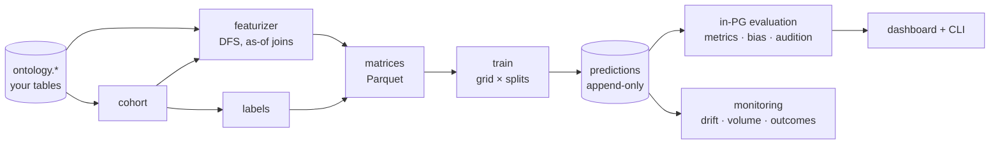
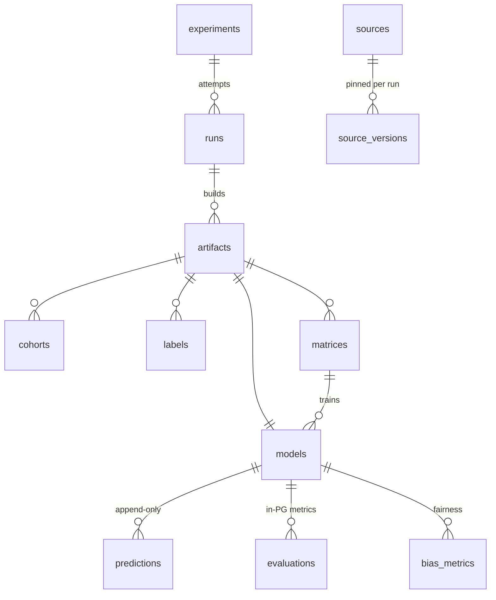
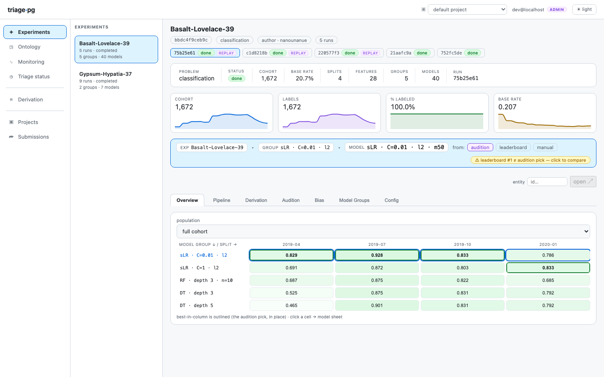

# triage-pg

[](https://github.com/ccd-ia/triage-pg/actions/workflows/ci.yml)
[](https://github.com/ccd-ia/triage-pg/releases)
[](https://github.com/orgs/ccd-ia/packages/container/package/triage-pg)
[](LICENSE)

**A PostgreSQL-native, deliberately simplified fork of [`triage`](https://github.com/dssg/triage) for temporal machine learning on tabular public-policy data.**

triage-pg builds end-to-end early-warning and resource-prioritization models — cohort selection, temporally-correct feature generation, training, prediction, and in-database evaluation — with PostgreSQL as the single substrate, aimed at teaching, consulting, and production monitoring.

> **Status: local v1 complete.** The full pipeline runs end-to-end on three real tutorial datasets across all four problem types (including survival), with in-PG evaluation, fairness auditing, audition, postmodeling diagnostics, a read dashboard + write webapp, and production monitoring. The cloud profile (RDS + S3 + AWS Batch) is authored and offline-validated; its live validation is the gate between `v1.0.0-rc1` and `v1.0.0`. All 28 architecture decisions are audited against the code in [`docs/adr-conformance.md`](docs/adr-conformance.md).

**New here?** Open [`docs/onboarding.html`](docs/onboarding.html) (the one-pager) · **Coming from DSSG triage?** Read [`docs/triage-pg-vs-dssg-triage.html`](docs/triage-pg-vs-dssg-triage.html) — the honest side-by-side.

## The pipeline



Every artifact along the way (cohort, labels, matrices, models) is content-addressed over its **complete input closure** — caching, provenance, and GC come from one derivation DAG ([`docs/derivation-dag.md`](docs/derivation-dag.md)).

## The database schema

triage-pg is **two-tier** (ADR-0002): a small **registry** control-plane database (projects, users, submissions) routes to **one project database per Project**, each holding a `triage` schema. Only predictions and evaluation live in Postgres — matrices are Parquet on local FS / S3. Every built artifact (cohort, labels, matrices, models) is a **content-addressed node** in the derivation DAG, so caching, provenance, and garbage collection all fall out of the schema below (this is the per-project `triage` backbone; the derivation/GC and importance edges are elided — see the full ERD).



| Cluster | Tables |
|---|---|
| Lineage / run metadata | `experiments`, `runs`, `model_groups` |
| Artifact derivation DAG | `artifacts`, `artifact_inputs`, `run_artifacts` |
| Source registry & pinning | `sources`, `source_versions`, `run_source_pins` |
| Cohorts & labels | `cohorts`, `labels`, `protected_groups` |
| Matrices & models | `matrices`, `models` |
| Predictions | `predictions` — append-only, range-partitioned on `scored_at` (ADR-0006) |
| Evaluation & bias | `evaluations`, `bias_metrics`, `subsets` / `subset_members` |
| Postmodeling & importances | `feature_importances`, `individual_importances`, crosstabs / error-tree tables |

`problem_type` (`classification` · `regression_ranking` · `regression` · `survival`) and `artifact_kind` (`cohort` · `labels` · `feature_group` · `matrix` · `model`) are Postgres enums. The full ERD — every foreign-key edge with its `ON DELETE` behavior (CASCADE / RESTRICT to enforce append-only history / SET NULL) — is in [`docs/erd.md`](docs/erd.md); the design rationale (registry + per-project split, resolved decisions) is in [`docs/schema-design.md`](docs/schema-design.md).

## What you get

| Capability | The triage-pg shape |
|---|---|
| **Problem types** | classification · regression-as-ranking · regression · **survival** (scikit-survival + an in-PG C-index matching `concordance_index_censored` to 1e-9) — one `problem_type` switch (ADR-0010/0026) |
| **Features** | [`featurizer`](https://github.com/ccd-ia/featurizer): PostgreSQL-native Deep Feature Synthesis, point-in-time-correct via as-of joins (ADR-0008) |
| **Evaluation** | PL/pgSQL over the predictions table — precision@k/recall@k/AUC/AP, RMSE/MAE/R², C-index; per-date rows + windowed rollups; **subset evaluations** on named cohort slices (ADR-0007) |
| **Fairness** | SQL group-bys over `protected_groups`: 8 per-group metrics with disparity + τ verdicts, config-driven ingestion, and the Aequitas **fairness tree** as a guidance wizard ([`docs/fairness.md`](docs/fairness.md)) |
| **Model selection** | in-PG audition: distance-from-best, max regret, regret-next-time, all 8 DSSG selection rules — dashboard tab + `triage audition` |
| **Postmodeling** | crosstabs, error trees ("where does it fail?"), calibration, list overlap, per-entity contributions — CLI computes, PG persists, dashboard reads ([`docs/postmodeling.md`](docs/postmodeling.md)) |
| **Monitoring** | scheduled `triage score` + drift (PSI/KS at scipy parity), volume, calibration, realized-outcome tracking — SQL over append-only predictions, no daemon (ADR-0027, [`docs/monitoring.md`](docs/monitoring.md)) |
| **Multi-tenancy** | one database per project + a registry control plane; project switcher in the dashboard; `triage project create/drop` (ADR-0002/0025) |
| **UIs** | read dashboard (experiments ▸ model groups ▸ models) + write webapp (validated submissions) + OIDC auth — all business-logic-free (ADR-0012/0024/0028) |
| **Deployment** | `local` (standalone PostgreSQL) and `cloud` (RDS IAM + S3 + AWS Batch; Terraform in [`infra/terraform/`](infra/terraform/)) behind one profile seam (ADR-0003–0005) |

|  |  |  |
|---|---|---|
| the experiment overview | one model's card | production monitoring |

## Five minutes to a running experiment

```bash
uv sync --extra dev --extra dashboard
just chi311-up                                   # real Chicago 311 data in a docker Postgres
# …point triage at it and run (full steps: docs/quickstart.md)
uv run triage --dbfile chicago311-database.yaml run \
  example/chicago311/experiment.yaml --project-path /tmp/chi311-run
uv run triage leaderboard <experiment-hash>      # or `just serve` for the dashboard
```

The complete walkthrough — including your-own-data projects, the multi-project dashboard, webapp submissions, fairness auditing, and diagnostics — is [`docs/quickstart.md`](docs/quickstart.md). Three tutorial datasets ship as self-contained dockers: **DirtyDuck** food inspections ([`dirtyduck/`](dirtyduck/README.md)), **DonorsChoose** KDD Cup 2014 ([`donorschoose/`](donorschoose/README.md)), and **Chicago 311** ([`chicago311/`](chicago311/README.md)).

Installation reality: not on PyPI — clone and `uv sync`. Needs PostgreSQL 11+ (plain, no extensions). Optional extras: `dashboard` (FastAPI + SPA), `survival` (scikit-survival), `oidc` (real webapp auth).

No local Python at all: every release ships a public container — `docker pull ghcr.io/ccd-ia/triage-pg:v1.0.0-rc1` gives you the `triage` CLI (and a `dashboard` image stage) against any PostgreSQL you point it at.

## Acknowledgment — built on DSSG's triage

triage-pg is a fork of **[triage](https://github.com/dssg/triage)**, created by the **Center for Data Science and Public Policy (DSaPP) at the University of Chicago** and maintained at **Carnegie Mellon University**. The hard, valuable ideas at the heart of this project are theirs: temporal cross-validation (`timechop`), leakage-safe feature engineering, reproducible model governance and hashing, bias auditing, and the whole "operational design questions → modeling choices" framing. The feature engine triage-pg adopts, [`featurizer`](https://github.com/ccd-ia/featurizer), is likewise a DSSG-lineage Deep Feature Synthesis project.

triage-pg stands on that work, **preserves its MIT license and copyright**, and keeps the full git history for attribution. Thank you to the triage authors and community.

If you want the original, full-featured, battle-tested toolkit, use **[dssg/triage](https://github.com/dssg/triage)** — it is actively maintained and supports a great deal that triage-pg deliberately drops. The dimension-by-dimension comparison lives in [`docs/triage-pg-vs-dssg-triage.html`](docs/triage-pg-vs-dssg-triage.html).

## Why a separate project?

An effort to modernize triage *in place* (PR #994 on dssg/triage) accumulated too much friction against the existing test suite, dependency surface, and backward-compatibility constraints to be worth continuing. Rather than keep fighting that, triage-pg starts from triage's modernized core and takes a different, **opinionated and intentionally breaking** direction — one that does not belong upstream because it removes and reshapes things the original supports:

- **PostgreSQL as the whole substrate.** Evaluation, leaderboards, audition, and bias metrics run *in the database* (PL/pgSQL over a predictions table), not in pandas. No Aequitas dependency — fairness metrics are SQL group-bys, guided by the Aequitas fairness tree.
- **A modern feature engine.** Feature generation moves from Collate to [`featurizer`](https://github.com/ccd-ia/featurizer), a PostgreSQL-native Deep Feature Synthesis engine that is point-in-time-correct via as-of joins.
- **More problem types.** Beyond binary classification: regression-as-ranking, pure regression, and fully runnable survival analysis, selected by a `problem_type` switch.
- **Append-only, monitoring-ready predictions** — timestamped and partitioned, so prediction history is captured from day one; production monitoring is a config block and a cron line, not a service.
- **Guix-style artifact derivation DAG.** Every built artifact (cohort, labels, feature groups, matrices, models) is identified by a hash over its *complete input closure*, with explicit dependency edges recorded in the project database. Caching is by derivation (no manual `replace=True` vigilance), provenance is queryable in SQL, and garbage collection works by reachability from live roots. See [`docs/derivation-dag.md`](docs/derivation-dag.md) and ADRs 0013–0017.
- **Multi-tenant by database.** One PostgreSQL database per project plus a registry control plane, with two deployment profiles: a **local** profile (standalone PostgreSQL — laptops, teaching, tests) and a **cloud** profile (RDS/Aurora + IAM auth + S3 + AWS Batch).
- **Smaller surface.** No standalone postmodeling module (it dissolved into persisted diagnostics + SQL views + dashboard panels); `rq` and multicore orchestration removed; modern tooling throughout (uv, ruff, loguru, typer, psycopg3, Python 3.12).

The full rationale — decision by decision — lives in the Architecture Decision Records under [`docs/adr/`](docs/adr/), with the domain glossary in [`CONTEXT.md`](CONTEXT.md) and the results-database design in [`docs/schema-design.md`](docs/schema-design.md).

## Development

triage-pg uses the Astral toolchain:

```bash
uv sync --extra dev          # create / sync the environment
just --list                  # list available recipes
just test                    # run the test suite
just alembic upgrade head    # apply the results-schema migration (needs a PostgreSQL)
```

Database connection comes from `DATABASE_URL` or the standard `PG*` environment variables (e.g. loaded via direnv) — there are no hardcoded credentials. Tests spin up their own throwaway PostgreSQL via `pytest-postgresql`.

## License

MIT — see [`LICENSE`](LICENSE). triage-pg is a derivative work of triage (© 2019 Data Science and Public Policy, University of Chicago); the original copyright notice and MIT terms are preserved.
