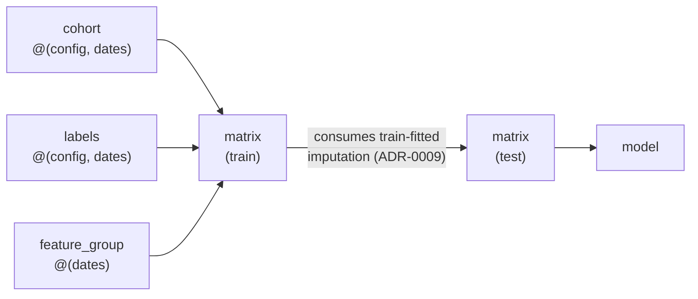

Every artifact triage-pg builds — a cohort, labels, a feature group, a
matrix, a model — carries an **identity**: a hash over its *complete input
closure*, computed à la Guix. Two builds with the same closure get the same
hash, so the second one is a cache hit. This is the mechanism that replaces
the inherited `replace=True` flag, whose hashes covered config text only and
missed the data, the code, and the upstream artifacts entirely (ADR-0013).

Four properties fall out of this, exactly as they do in the Guix store:

- **Exact cache reuse** — same inputs ⇒ same hash ⇒ skip the build.
- **Minimal incremental rebuilds** — a changed input invalidates precisely
  its downstream cone, nothing else.
- **Provenance** — any artifact can answer "what exact inputs produced you?"
  in plain SQL, because the DAG lives in the project's PostgreSQL schema.
- **GC by reachability** — an artifact unreachable from any retained root can
  be collected; matters most for Parquet matrices on disk or S3.

Predictions are the deliberate exception: they are append-only **events** with
lineage columns, not cache entries, and are never deduplicated (ADR-0006).
The cached DAG stops at models.

## What enters a node's hash

An artifact's identity — its **Derivation** — is a SHA-256 over four things,
serialized as canonical JSON (sorted keys, normalized scalars):

```
artifact_id = H( kind
              ∥ canonical(own_config)         -- this artifact's config slice
              ∥ sorted(parent_artifact_ids)   -- upstream artifacts (Merkle DAG)
              ∥ sorted(source_pins)            -- (source, version) pairs, ADR-0014
              ∥ sorted(engine_versions) )      -- triage-pg, featurizer, …, ADR-0016
```

Because each parent's id is embedded, this is a **Merkle DAG**: a matrix's id
embeds its feature/cohort/label ids, a model's id embeds its matrix id, so any
upstream change ripples downward on its own. Building is **lookup-or-create** —
a present id with an existing output is a cache hit; otherwise build and record.
A `--force` stays as an operator override.

A small worked closure:



The test matrix takes the train matrix as a parent: it consumes the
train-fitted imputation statistics, so the leakage boundary (ADR-0009) is an
explicit DAG edge, not a convention.

## Source pins make the closure cacheable

A Postgres table has no cheap content hash, so a **Source** enters identity as
a *declared pin*, not by hashing its rows (ADR-0014). Cohort, label, and
feature configs declare the tables they read — SQL is never parsed to discover
them; an undeclared input does not exist for identity purposes. A registry
records a `version_label` per load, bumped by the ETL or by `triage source
bump`, and at plan time the adapter **freezes** the sorted
`(source_name, version_label)` pairs into every downstream hash. The pin set is
recorded per run — the `guix describe` analog: any closure can answer "built
against `events` at `v2026-06-10`".

Pinning is what makes a closure cacheable at all. A declared source with **no
registered version is volatile**: every derivation that touches it is marked
non-cacheable and always rebuilt, with a loud warning explaining how to
register or bump it. The failure mode of manual pinning is a wasted rebuild —
never a silently stale cache hit. (Teaching datasets like DirtyDuck run
unpinned-with-warnings, so quickstarts have zero setup friction.) Cheap
fingerprints — row count, `max(knowledge_date_column)` — are captured
*advisory-only* to warn when the data moved but nobody bumped the pin; they
**never enter identity**, because a backfill can leave them unchanged.

## Engine versions, per kind

A version enters identity if and only if it can change the artifact's **output
bytes given identical config and inputs** — the compiler-versus-runtime
criterion (ADR-0016). Engines are *compilers*: featurizer maps config to SQL
(a window-boundary fix moves events in or out, changing feature values);
scikit-learn gives different coefficients for the same matrix, hyperparameters,
and seed across releases and guarantees no cross-version equivalence. So the
compilers hash, per kind:

| Kind             | Engines in identity                                     |
|------------------|---------------------------------------------------------|
| cohort / labels  | triage-pg                                               |
| feature_group    | triage-pg + featurizer                                  |
| matrix           | triage-pg                                               |
| model            | triage-pg + the estimator's distribution (e.g. sklearn) |

This is encoded by `engine_versions_for(kind, estimator_class_path)`.
Invalidation propagates through the DAG on its own: an sklearn bump rebuilds
models only; a featurizer bump rebuilds feature groups → matrices → models.
PostgreSQL and Python are *runtimes* — semantically transparent by contract —
so they are excluded from identity and recorded at the **run** level for
forensics instead. Identity uses installed **release versions**, not git hashes:
hashing the git SHA would invalidate every cache on every commit, unusable while
developing triage-pg itself (`runs.git_hash` keeps the forensic trail).

Versions always hash — two artifacts built by different engines are different
artifacts. The only configurable part is what a miss *caused purely by engine
drift* means: each derivation also carries a `logical_id` computed without
engine versions, and `policy="logical"` opts into reusing the latest artifact
with a matching logical id, emitting a loud ENGINE-DRIFT REUSE warning naming
both version sets. It is the explicit escape hatch for laptop↔cloud version
skew — never the silent default.

### Why resolving the estimator version has to be robust

Because the estimator library's version enters **model** identity, resolving
that version cannot be allowed to fail. `engine_versions_for("model", …)` maps
the estimator's import package to its distribution via
`importlib.metadata.packages_distributions()` — but that reverse-map is built
from `top_level.txt` / `RECORD`, which PEP 660 editable installs (a plain
`uv sync` of this project, as in CI) frequently omit. So triage-pg's own
`triage.*` estimators resolved to *nothing* even though the distribution was
installed, and the lookup raised. The fix falls back to the top-level module
name as the distribution name (which holds for `triage`, `sklearn`, `sksurv`,
…), and that resolves to the same `(name, version)` the reverse-map would have
returned when present. Identity was preserved — the recorded version is
unchanged across editable and non-editable installs — the crash was not.

## Garbage collection: outputs, not history

The storage that matters is Parquet matrices, model files, and in-PG
date-slices; the artifact *rows* are tiny and carry the very provenance this
design exists to provide. Because every closure is pinned, a deleted output is
**re-derivable** (the Guix substitute property). So `triage gc` deletes the
**outputs** unreachable from a retained root and flips their rows to
`status='collected'`; a cache lookup only returns `'built'`, so a collected
artifact transparently rebuilds on next demand (ADR-0017). This is deletion of
dead *outputs*, not of history — row deletion is a separate, rarely-needed
`--purge` (project teardown is already `DROP DATABASE`, ADR-0002).

Roots are the artifacts used by runs of **non-archived** experiments, plus any
**predicted model** (append-only predictions pin their model regardless of
experiment lifecycle — you cannot audit a list whose model is gone). Live =
roots plus their full upstream closure. `triage archive <hash>` is the
reversible root-removal gesture; `triage gc` is a **dry run by default**
(reporting what is collectible), collecting only with `--delete`. There is no
scheduled auto-GC — silently deleting expensive-but-rebuildable artifacts is
the wrong default.

## See also

- [Technical architecture](/triage-pg/reference/architecture/) — the results
  schema and where the derivation DAG lives in it.
- [The problem space](/triage-pg/reference/problems/) — `problem_type` is part
  of an experiment's identity; `task_framing` is identity-neutral.
- [The CLI tour](/triage-pg/reference/cli/) — `triage source bump`,
  `triage archive`, and `triage gc` in context.
- [The DirtyDuck tutorial](/triage-pg/tutorials/dirtyduck/) — cache reuse and
  source pins on a real dataset.
