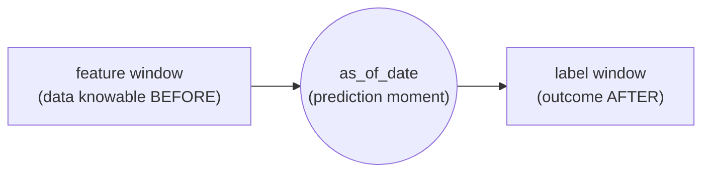

Everything triage-pg does rests on one rule. Get it wrong and your offline
metrics look wonderful and your deployed model fails — quietly, in exactly the
way that is hardest to catch.

## The cardinal rule

> The features for a row at a given **`as_of_date`** may use only data knowable
> **strictly before** that date.

`as_of_date` is *the point in time at which a prediction is made*. Each
[Matrix](/triage-pg/concepts/the-data-model/) row is keyed by
`(entity_id, as_of_date)`, and the promise that row makes is precise: it is what
you would have known about that entity **at that instant**, and nothing you only
learned afterwards. Not "roughly around then" — strictly before.

The rule is not a stylistic preference; it is the difference between a metric
that predicts the future and one that predicts the past. When a feature sneaks
in information from on or after the `as_of_date`, the model gets a peek at the
answer while training. This is **leakage**, and it is insidious for one reason:

- **Offline, it inflates every metric.** Precision@k, AUC, R², C-index — all of
  them go *up*, because the model is being graded on a test set that also
  contains the leaked signal. The experiment looks like a triumph.
- **In production, the leak is gone.** At real scoring time (`triage score`),
  the future has not happened yet. The leaked column is empty, stale, or
  unknowable, and the model that scored 0.9 offline collapses to the base rate.

There is no warning bell. A leaky experiment and a sound one look identical on
the leaderboard; the gap only appears months later, in production, when it is
expensive to diagnose. That is why point-in-time correctness is enforced by
construction rather than trusted to reviewers.

## Knowledge date, not event date

The subtlest leaks come from confusing **when something happened** with **when
you found out**. Every feature source in triage-pg declares a
`knowledge_date_column`, and it must reflect *when the data became known*, not
when the underlying event occurred.

The two dates diverge constantly in real administrative data:

- An inspection is conducted on the 1st, but the result is not entered into the
  system of record until the 15th. Its **event date** is the 1st; its
  **knowledge date** is the 15th.
- A lab test is dated when the sample was drawn, but the result — the thing your
  model would key on — lands days later.
- A case is back-dated on filing, so the row's own timestamp precedes the moment
  anyone could have queried it.

Filter on the event date and you will hand the model results that, on the
`as_of_date`, no one had yet seen. The `knowledge_date_column` is the guardrail:
the [Feature engine](/triage-pg/concepts/the-data-model/) (featurizer)
synthesizes point-in-time-correct features by cutting on *knowledge*, so a
feature window ending strictly before the `as_of_date` contains only
genuinely-knowable facts.

## A worked timeline

Read a single `(entity_id, as_of_date)` row left to right:

- **Feature window** — everything to the *left* of the `as_of_date`, filtered by
  `knowledge_date_column`. This is the model's input, `X`.
- **`as_of_date`** — the instant the prediction is made. The
  [Cohort](/triage-pg/concepts/the-data-model/) is the set of entities eligible
  for prediction here.
- **Label window** — `[as_of_date, as_of_date + label_timespan)`, strictly to the
  *right*. This is the future the model is asked about, `y`. It is used to *grade*
  the prediction, never to *build* the features.

The two windows meet at the `as_of_date` and never overlap. timechop generates
these splits so that every training row's label window closes before any test
row's `as_of_date` opens — the same wall, one level up. (For the choices this
opens up — early-warning vs. selective labels, and the four
[problem types](/triage-pg/concepts/problem-types-and-ranking/) — see the
problem-space reference.)

## The imputation split is the leakage boundary

Point-in-time correctness would be easy if features never had gaps. They always
do, and **every feature needs an explicit imputation rule** — a tree that
tolerates NaN will silently absorb a missing value rather than fail, so
triage-pg refuses to score a matrix with any un-imputed NULL. But *how* you fill
a gap is itself a place leakage hides, so ADR-0009 splits imputation along a
hard boundary:

**Fit-free imputation** computes nothing from the data. A `zero` or `constant`
fill, plus a `*_imp` missing-indicator flag column that lets the model see *that*
the value was absent, is safe anywhere and at any time — the fill for one row
does not depend on any other row. Fit-free rules live in **featurizer**, which
is split-blind by design and must stay that way.

**Fit-based imputation** computes a statistic — `mean`, `median`, `mode` — and
that statistic is a summary of *many rows at once*. Fit it over the whole
[Matrix](/triage-pg/concepts/the-data-model/) and the mean you impute into a
training row is contaminated by test-period entities: the future has leaked into
the past through the fill value. So fit-based imputation lives in the
**triage-pg adapter**, and the rule is blunt:

> **Never fit a statistic over the full matrix.** The statistic is computed on
> the **training split only**, then applied unchanged to both train and test.

Only triage-pg knows the timechop train/test split — a concept featurizer must
never learn. So the adapter fits each fit-based statistic on the train rows,
persists it into `triage.matrices.metadata`, and *reuses* it for the test split
via the train→test parent edge. It is never recomputed from test rows and never
refit per `as_of_date`. Categorical encoding follows the identical boundary by
vocabulary source: a **declared/fixed** vocabulary (from config or a PostgreSQL
`ENUM`) is fit-free; a **learned** vocabulary is a fit-based transform, fitted on
the train split only.

A practical corollary: featurizer's own `measure_strategy=mean/median` must
never be used on triage-pg's path — it fits over the full matrix, which is
precisely the leak this boundary exists to prevent. triage-pg consumes
NULL-preserving features from featurizer and applies **both** fills — the
fit-free zero/constant + `*_imp` flag *and* the fit-based `COALESCE` — in its own
adapter SQL, so the leakage boundary stays on triage-pg's side of the seam. The
imputation policy enters the matrix's [derivation](/triage-pg/reference/configuration/)
hash, so changing a rule rebuilds the matrix rather than silently reusing a stale
one.

## Why it is worth the awkwardness

Splitting one concern — "fill the gaps" — across two repositories looks
accidental until you see what it buys: imputation, the one preprocessing step
most tempted to peek across the whole dataset, is structurally unable to. The
fit-free half cannot leak because it reads no other rows; the fit-based half
cannot leak because it only ever sees the training split. The cardinal rule ends
up guaranteed by *where the code lives*, not by remembering to be careful.
