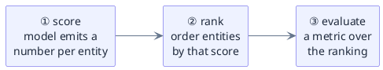

triage-pg is a **prioritization** system, and its whole architecture is a single
spine. Whatever the dataset or the target, every experiment walks the same three
steps:

The `problem_type` on an Experiment selects a few **swaps** on that spine — how the
score is produced, how entities are ranked, which metric judges the ranking, and
what shape the label takes. Everything else stays fixed. Pick the wrong
`problem_type` and the machinery still runs, but you are answering a different
question than the one you meant to ask (ADR-0010).

**Why a ranking spine at all?** Public-policy ML is almost always *"we can act on
the top **k** — which entities?"*: which slow 311 requests to escalate, which
facilities to inspect, which students to support. The deliverable is an
**ordering**, so the spine optimizes and measures the ordering directly —
precision@k and recall@k are first-class, not afterthoughts.

## The four problem types

Each `problem_type` swaps the same four slots on the spine. This is the compact
view; the [full problem space](/triage-pg/reference/problems/) narrates each one
end to end with worked configs.

| `problem_type` | ① score is… | ② rank by… | ③ primary metrics | label columns |
|---|---|---|---|---|
| `classification` | `P(y=1)` | descending probability | `auc_roc`, `precision@k`, `recall@k`, `average_precision` | `outcome` (0/1) |
| `regression_ranking` | predicted value | descending predicted value | `rmse` / `mae` / `r2`; `precision@k` when declared | `outcome` (continuous) |
| `regression` | predicted value | (ranking incidental) | `rmse`, `mae`, `r2` | `outcome` (continuous) |
| `survival` | predicted risk / hazard | descending risk | `c_index` (Brier deferred) | `duration`, `event_observed` |

**`classification`** is the default. The label is a binary `outcome`; the model
emits a positive-class probability; entities rank by that probability. The score is
*not* a decision — the top-k cut you act on is a capacity choice made at evaluation
time, not baked into training. All three tutorial datasets ship a classification
config.

**`regression_ranking`** is the primary mode for continuous targets (ADR-0010).
When the target is a quantity — dollars at risk, days to resolution, demand units —
but the decision is still "act on the top **k**", you rank by the predicted value
and train on the richer continuous signal instead of a binarized version of it.
Note that it does **not** default to `precision@k`: threshold metrics presume a
binary outcome the continuous target lacks, so declare them explicitly when the
outcome semantics support a top-k cut (ADR-0026).

**`regression`** (pure) is for when you genuinely need the point estimate — a
forecasted cost, a caseload — and no ordering. Same continuous label as
`regression_ranking`; the two differ only in intent and evaluation emphasis.
Declaring `regression` says "the magnitude is the product"; `regression_ranking`
says "the ordering is the product".

**`survival`** graduated from a future bolt-on to a fully runnable path (ADR-0026).
The model emits a **risk score** — higher means the event is expected sooner — which
rides the same score → rank → evaluate spine. It is evaluated by the **concordance
index** (`c_index`), a PL/pgSQL function that matches scikit-survival's
`concordance_index_censored` to 1e-9. Survival requires the `survival` extra
(`uv sync --extra survival`); its house estimator is `ScaledCoxPHSurvivalAnalysis`.
Brier score remains deferred.

## Label columns follow the problem type

The `problem_type` dictates the columns your label query must emit — this is a hard
contract, not a convention:

- `classification`, `regression_ranking`, and `regression` emit a single `outcome`
  column (integer 0/1 for classification, continuous otherwise).
- `survival` emits `(duration, event_observed)` instead. `event_observed = false`
  is **censoring**: the observation window closed before the event, so `duration` is
  a lower bound, not a miss.

The greenfield label schema carries all three columns at once — `outcome`, plus the
nullable `(duration, event_observed)` pair — so survival needed no schema migration
(ADR-0010). Non-survival experiments simply leave the survival pair `NULL`. Getting
the columns wrong is a config-time error: a `survival` experiment without a
`duration` fails validation before any model is fit.

Because these columns are read only *after* an `as_of_date`, the query must still
respect [point-in-time correctness](/triage-pg/concepts/point-in-time-correctness/):
a label describes what happened in the forward window, never data that leaks the
answer back before the prediction date. Cohort and label queries are templated SQL
carrying `{as_of_date}` and `{label_timespan}` placeholders; the required output
columns are the part `problem_type` fixes.

## `task_framing` is an orthogonal axis

`problem_type` says *what the model predicts and how it's scored*. A second config
key, **`task_framing`**, says something the math cannot: *under what conditions does
reality hand you a label?* Its three values —

- **`early_warning`** — the outcome is administratively recorded for every cohort
  member (~100% labeled);
- **`resource_prioritization`** — the outcome exists only for entities someone acted
  on (well under 100% labeled — selective labels);
- **`visit_level`** — the label attaches to an event, not an entity-period.

`task_framing` is **identity-neutral**: adding or changing it never forks an
Experiment's hash, because it changes how you should *read* the numbers — what a base
rate means, whether missing labels are a bug or a fact of life — not how they are
computed (migration 0019). The two axes compose freely, which is why there is no
4×3 matrix to memorize. The [full problem space](/triage-pg/reference/problems/)
page teaches each axis exactly once and shows all four problem types and all three
regimes exercised on the real tutorial datasets.

## Where to go next

- The [full problem space](/triage-pg/reference/problems/) — the exhaustive,
  two-axis treatment with committed configs for every problem type and regime.
- The [configuration reference](/triage-pg/reference/configuration/) — every config
  key, including `problem_type`, `task_framing`, and the `evaluation` metric block.
- [Point-in-time correctness](/triage-pg/concepts/point-in-time-correctness/) — the
  cardinal rule the label query above must obey.
