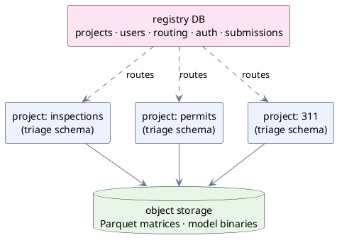

Two questions decide where every byte triage-pg produces ends up: *which
project owns it?* and *does an in-Postgres query need to read it?* The answers
give a small, sharp storage model — one control-plane database, one database
per project, and a deliberate line between the tables Postgres holds and the
files it only points at.

## A database per project, plus a registry

Each **Project** is one isolated PostgreSQL **database** inside a shared
cluster (ADR-0002). Isolation is at the database level, not a `project_id`
column, so a project database *is* the tenant boundary — there are no
`project_id` columns anywhere inside it, and teardown is a single
`DROP DATABASE`. Everything a project builds lives in one `triage` schema in
that database (ADR-0003 keeps it plain PostgreSQL, so the identical schema runs
on a laptop, in Docker, self-hosted, or on RDS).

The state that *can't* live inside any one project — the list of projects
themselves, who may see them, where each one routes — lives in a dedicated
**registry** database, the control plane:

The registry holds projects, users, per-project routing/connection info,
permissions, and the webapp's auth — plus an append-only **Submission** audit
row for every experiment sent through the write webapp (who submitted which
config, to which project, under which profile). What it deliberately does *not*
hold is database credentials: the cloud profile mints short-lived RDS IAM
tokens per project (ADR-0004), the local profile reads the environment. The
dashboard's project switcher asks the registry where a request should go and
routes it to the right project pool (ADR-0025).

One consequence is worth stating plainly: **cross-project SQL is not native**.
A query spanning several projects — a teacher's leaderboard over every
student's project, say — would need `postgres_fdw` or app-side aggregation.
That is the price of database-level isolation, and for confidential client data
it is a price worth paying: a query can never accidentally reach across the
tenant boundary because the boundary is the database itself.

## What lives in the project database — and what doesn't

Only *decisions and their evaluation* live in Postgres. The `triage` schema
holds append-only [predictions](/triage-pg/concepts/problem-types-and-ranking/),
in-database evaluations, fairness metrics, feature importances, and the full
lineage of experiments, runs, and content-addressed artifacts. That is exactly
the set the in-Postgres metrics need to read — precision@k, AUC, C-index,
bias group-bys are all SQL over these tables (ADR-0007).

**Matrices are Parquet, never in Postgres.** A [Matrix](/triage-pg/concepts/point-in-time-correctness/)
is the `(entity_id, as_of_date)`-keyed feature table for a split; the bytes
live as a Parquet file on the local filesystem (local profile) or S3 (cloud
profile), addressed by the artifact hash (ADR-0005). Trained **models** are
serialized artifacts — joblib binaries — on that same storage, beside the
matrices. What the project database *does* keep is a thin pointer row: the
`matrices` and `models` tables each carry a `storage_uri` and some metadata,
but not the payload. The hash that names the file is the same
[derivation identity](/triage-pg/concepts/identity-and-caching/) used for
caching and provenance, so the pointer and the file can never drift apart.

The reason for the split is proportion: a matrix can be gigabytes of dense
features, and nothing in Postgres ever queries a raw feature cell — it queries
scores and labels. Keeping the heavy, never-queried bytes on cheap object
storage and the light, constantly-queried results in Postgres is the whole
design in one sentence.

## Predictions are append-only

Every scoring run **inserts** rows; it never updates them (ADR-0006). Each
prediction row carries a `scored_at` wall-clock timestamp alongside its
`as_of_date`, and the table is range-partitioned on `scored_at` — quarterly,
keep-forever by default. A model scored on the same entities twice produces two
generations of rows, both preserved. The foreign key from `predictions` to
`models` is even set to `RESTRICT`, so deleting a model that has been scored
fails loudly rather than silently eating its history.

This is cheap insurance for monitoring. Because history is captured from day
one, drift, volume, and score-trajectory analyses become a `GROUP BY` over the
accumulating partitions later, with zero migration — a current-state table that
overwrote on re-run could never recover history it never recorded.

The concept a user must internalize is the flip side of that guarantee:

> **A score is not the latest score.** Any read that wants the *current*
> prediction for an entity must pick the row with the greatest `scored_at`.

triage-pg does this for you in the `latest_predictions` view (a
`distinct on (model_id, entity_id, as_of_date) … order by scored_at desc`), and
the ranked and monitoring views build on top of it. But if you query
`triage.predictions` directly, remember that you are looking at *every* scoring
generation at once, not a snapshot.

## Where does X live?

| What | Where it lives |
|---|---|
| Predictions, evaluations, fairness metrics, feature importances, experiment/run lineage (the whole `triage` schema) | The **project** database — PostgreSQL |
| Matrices | **Parquet** files on local disk or S3 — never in Postgres |
| Trained models | Serialized (joblib) binaries beside the matrices on disk / S3 |
| Pointer + metadata rows for those matrices and models | The **project** database (`storage_uri`, not the bytes) |
| Projects, users, per-project routing, permissions, webapp auth, submission audit | The **registry** database |

## Where next

- [Identity &amp; caching](/triage-pg/concepts/identity-and-caching/) — how the
  artifact hash that names every Parquet file and model binary is computed, and
  why identical inputs skip the build.
- [Point-in-time correctness](/triage-pg/concepts/point-in-time-correctness/) —
  what a Matrix row promises, and the imputation split that protects it.
- [The architecture reference](/triage-pg/reference/architecture/) — the full
  results-schema ERD with every foreign key and its `ON DELETE` behavior.
