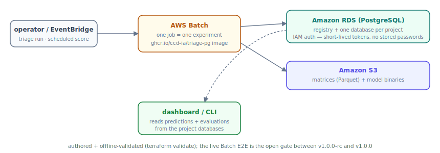

Todo lo que sigue está decidido en los 28
[architecture decision records](https://github.com/ccd-ia/triage-pg/tree/main/docs/adr)
comprometidos del repo y auditado contra el código en
[`docs/adr-conformance.md`](https://github.com/ccd-ia/triage-pg/blob/main/docs/adr-conformance.md);
esta página es el recorrido guiado.

## Dos niveles: un registry y una base de datos por proyecto

Un despliegue de triage-pg es una pequeña base de datos de plano de control
**registry** (proyectos, usuarios, submissions, ruteo por proyecto) más **una
base de datos PostgreSQL aislada por Proyecto**, cada una con un esquema
`triage` (ADR-0002). El desmontaje es `DROP DATABASE`; el SQL entre proyectos
deliberadamente no es nativo. El selector de proyectos del dashboard rutea cada
petición al pool del proyecto correcto vía el registry; el uso de un solo
proyecto no necesita registry en absoluto —la superficie de escritura
simplemente se reporta como de solo lectura.

PostgreSQL plano es una restricción dura (ADR-0003): sin extensiones
propietarias, así que el mismo esquema, funciones PL/pgSQL y vistas corren de
forma idéntica en una laptop, en Docker, autoalojado o en RDS.

## El esquema de resultados

Solo las *decisiones y los desenlaces* viven en la base de datos —predicciones
(append-only, particionadas por tiempo), evaluaciones, métricas de fairness,
linaje. Las matrices son Parquet en el sistema de archivos o en S3; los modelos
son binarios junto a ellas. La columna vertebral:

Tres aristas sostienen el diseño:

- **`artifacts` + `artifact_inputs`** —cada cosa construida (cohorte, etiquetas,
  grupo de características, matriz, modelo) es un **nodo direccionado por
  contenido** cuyo id hashea su *cierre de entradas completo*: configuración,
  artifacts padre, versiones de fuente ancladas, versiones de motor. El caché,
  la procedencia y la recolección de basura son todos el mismo mecanismo —una
  re-ejecución hace cache-hit en cualquier nodo cuyo cierre no haya cambiado, y
  `triage gc` borra exactamente lo que ninguna raíz alcanza.
- **`predictions` (RESTRICT, append-only)** —un score nunca es *el* score; es un
  renglón con una marca de tiempo `scored_at` (ADR-0006). El monitoreo sale de
  esto gratis: las vistas de drift, volumen y desenlaces realizados son solo SQL
  sobre el historial que se acumula.
- **`experiments` → `runs`** —un experimento *es el problema de predicción*
  (cohorte + etiqueta + configuración temporal; ADR-0022): las características,
  los grids y la imputación pertenecen al run, así que agregar características es
  un nuevo *intento*, no un nuevo problema, y los leaderboards se mantienen
  comparables entre intentos.

El diagrama completo con cada FK y su comportamiento `ON DELETE` está en
[`docs/erd.md`](https://github.com/ccd-ia/triage-pg/blob/main/docs/erd.md);
el fundamento del diseño en
[`docs/schema-design.md`](https://github.com/ccd-ia/triage-pg/blob/main/docs/schema-design.md).

## El pipeline

Una pasada de `triage run` (ADR-0012 —la CLI es el producto completo; ninguna
UI contiene lógica de negocio):

1. **Renglones de experiment + run**, luego **anclaje de fuentes (source
   pinning)** —cada fuente declarada se ancla a una versión en tiempo de
   planeación para que la cacheabilidad sea decidible;
2. **los splits temporales** (timechop) se despliegan en una construcción de una
   cohorte + una de etiquetas sobre la unión de fechas;
3. **características** —el Deep Feature Synthesis nativo de PostgreSQL de
   featurizer sobre el grafo de entidades de la configuración, correcto en
   punto-en-el-tiempo (point-in-time) vía joins as-of (ADR-0008);
4. **matrices** por split (Parquet; imputación basada en ajuste (fit-based)
   ajustada solo sobre el split de entrenamiento —la frontera de fuga de la
   ADR-0009);
5. **entrenar × grid**, luego **agregar predicciones** y **evaluar dentro de la
   base de datos** (precision@k, AUC, métricas de regresión, C-index de
   supervivencia —PL/pgSQL, coincidiendo con sus referencias de scikit hasta
   1e-9).

Cada etapa es un nodo artifact, así que interrumpir y volver a ejecutar reanuda
en lugar de rehacer.

## Cómo corre en AWS

La división `local`/`cloud` es una costura de tres adaptadores —auth, storage,
execution (ADR-0003/0004/0005)— no un fork del pipeline:

- **auth**: RDS IAM —los roles de base de datos por proyecto emiten tokens de
  corta vida; sin contraseñas de base de datos almacenadas en ningún lado;
- **storage**: matrices y binarios de modelo en S3, direccionados por los mismos
  hashes de artifact;
- **execution**: un job de AWS Batch por experimento, corriendo la misma imagen
  `ghcr.io/ccd-ia/triage-pg` que puedes descargar hoy; el paralelismo del grid
  se mantiene en proceso. La puntuación programada es una regla de EventBridge
  que invoca `triage score`.

El Terraform de todo esto vive en
[`infra/terraform/`](https://github.com/ccd-ia/triage-pg/tree/main/infra/terraform)
con el recorrido para el operador en
[`docs/cloud-runbook.md`](https://github.com/ccd-ia/triage-pg/blob/main/docs/cloud-runbook.md).
**Nota de honestidad**: el perfil cloud está escrito y validado offline
(`terraform validate`, costuras probadas con pruebas unitarias); el end-to-end
en vivo de Batch es la puerta abierta entre `v1.0.0-rc` y `v1.0.0`. Nada en esta
página pretende lo contrario.

## Hacia dónde seguir

- El [recorrido del dashboard](/triage-pg/es/reference/dashboard/) — cada
  superficie que alimentan estas tablas, con capturas de pantalla.
- El [recorrido de la CLI](/triage-pg/es/reference/cli/) — las mismas
  superficies, sin interfaz (headless).
- Los [tutoriales](/triage-pg/es/tutorials/) para ver todo el conjunto en
  ejecución.
