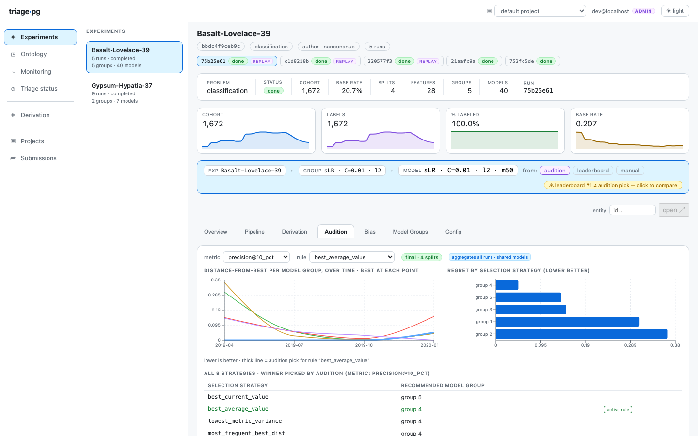
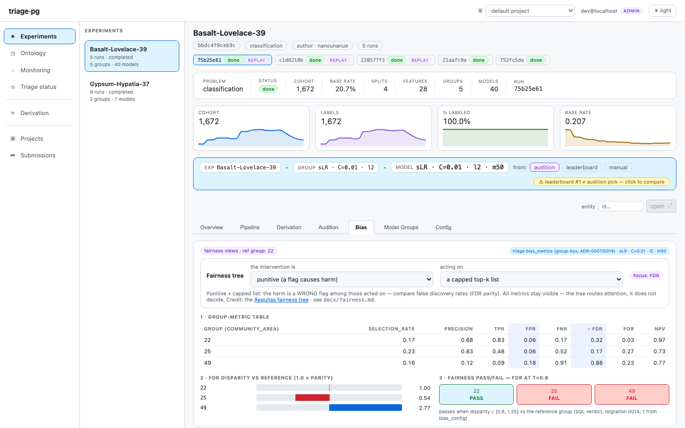
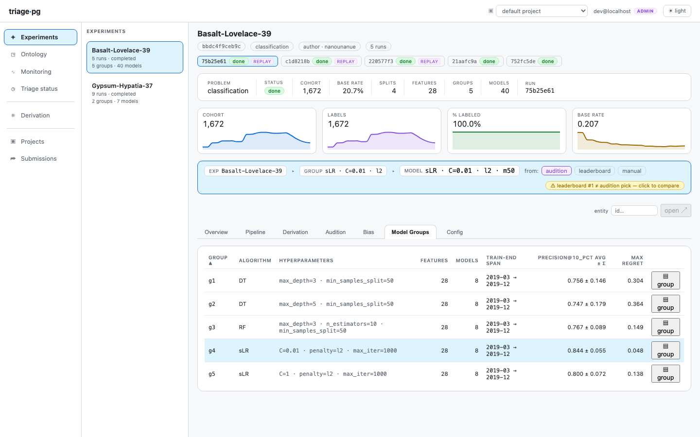
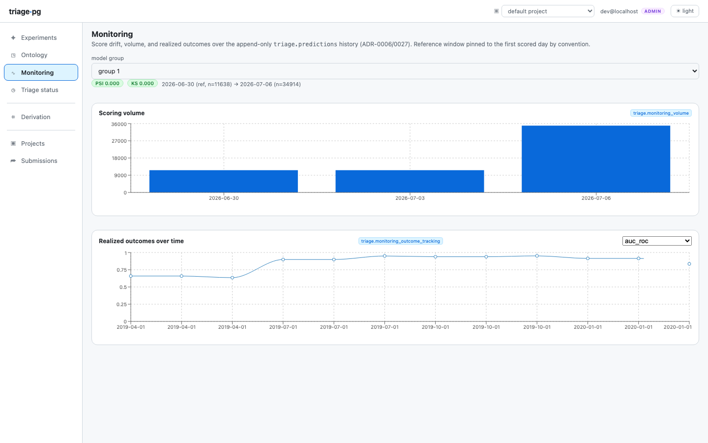
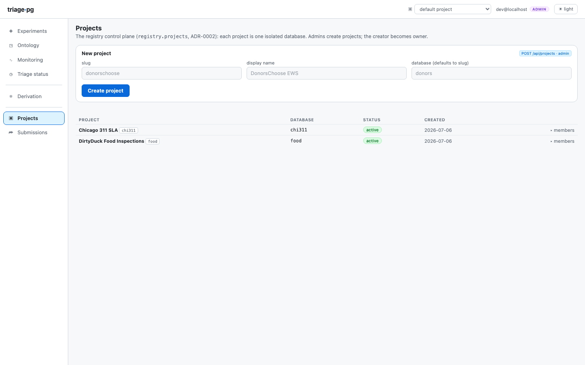
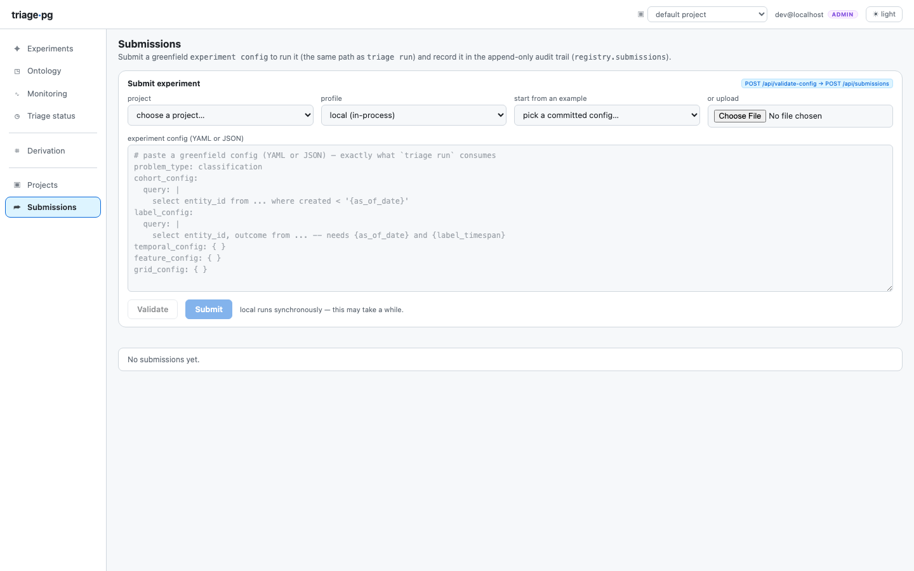

El dashboard es una ventana deliberadamente delgada: cada número que verás es
un `SELECT` sobre las vistas y funciones del esquema `triage` (ADR-0012 —sin
lógica de negocio en la UI), así que cualquier cosa que se muestre aquí es
igualmente automatizable desde [la CLI](/triage-pg/es/reference/cli/) o `psql`.
Inícialo con `just serve` contra cualquier base de datos de proyecto.

## Experimentos — la portada

Un renglón por **experimento** (= problema de predicción, ADR-0022): tipo de
problema, píldora de régimen de observación (`early warning` /
`resource prioritization` / `visit level`), conteos de modelos/grupos, tasa
base, estado del último run. La pregunta que responde: *¿qué problemas ataca
este proyecto y están sanos?*

## La vista general del experimento

La vista de trabajo. El encabezado lleva los chips de identidad (hash, tipo de
problema, encuadre) y las cuatro sparklines por split —tamaño de la cohorte,
etiquetas, %-etiquetado (consciente del encuadre: un problema de inspecciones
*espera* <100%), tasa base. Abajo, el **heatmap**: grupos de modelos × splits
temporales, con el mejor-en-split delineado —el panel de "¿qué familia de
modelos va ganando y es estable a lo largo del tiempo?". Un selector de
población reajusta el alcance de todo a un subconjunto con nombre cuando existen
evaluaciones por subconjunto.

## La tarjeta del modelo

El expediente de un modelo. La **curva de umbral** es el panel operativo
—precision/recall conforme barres el tamaño de lista k, es decir "si podemos
actuar sobre los top k, ¿qué obtenemos?". Histograma de scores, deciles de
calibración, importancias de características persistidas, y los paneles de
postmodeling (crosstabs, árbol de error) cuando `triage postmodel` se ha
ejecutado.

## Audition — selección de modelos con disciplina

Las reglas de selección de DSSG (distance-from-best, max regret,
regret-next-time…) calculadas como vistas SQL. La pregunta: *qué grupo de
modelos desplegaríamos realmente* —el que nunca está lejos del mejor a lo largo
del tiempo, no el ganador afortunado de un solo split. Cuando el #1 del
leaderboard y la elección de audition discrepan, la barra de contexto lo señala.

## Bias — fairness con una guía

Métricas por grupo protegido sobre la lista top-k con razones de disparidad y
veredictos-τ, directo desde la tabla SQL `bias_metrics` (las matemáticas de
Aequitas, sin runtime de Python). El **asistente del árbol de fairness** hace
las dos preguntas de Aequitas (¿punitiva o asistencial? ¿intervenir sobre todos
los marcados?) y resalta la familia de métricas que tu intervención realmente
implica.

## Grupos de modelos

El resumen por familia de hiperparámetros (promedio ± σ, max regret, tiempo de
ajuste) —y donde las corridas de ablación de grupos de características (ADR-0023)
se vuelven comparables lado a lado.

## Monitoreo

La vista posterior al despliegue sobre el historial de predicciones append-only:
drift de score (chips PSI/KS), el latido de volumen de puntuación y los
desenlaces realizados conforme maduran las etiquetas. El chip de propósito es el
marcador de honestidad de procedencia —los renglones `experiment` son historial
de backtest, los renglones `forward_score` son producción.

## Proyectos y Submissions — la superficie de escritura

Con un registry configurado (`TRIAGE_REGISTRY_URL`), **Projects** administra el
ciclo de vida de una-base-de-datos-por-proyecto y **Submissions** acepta
configuraciones de experimento a través del mismo validador que usa la CLI
—veredictos de dry-run con errores direccionados por ruta antes de que algo se
ejecute:

Sin un registry, ambos muestran un aviso neutral de solo lectura —un despliegue
soportado, no un error.

## Hacia dónde seguir

- El [cajón de entidad y el grafo de derivación](/triage-pg/es/tutorials/dirtyduckling/)
  aparecen en los recorridos guiados de los tutoriales.
- [Arquitectura](/triage-pg/es/reference/architecture/) explica las tablas que
  todo esto lee.
