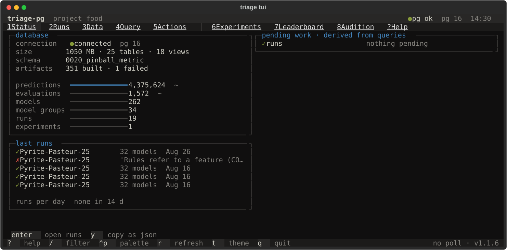

`triage tui` is the terminal cockpit of a triage-pg project. It is built on
[lynkeus](https://github.com/nanounanue/lynkeus), a shared Textual shell that
gives every PostgreSQL-backed project the same six screens, keys and theme;
triage-pg supplies three adapters and three screens of its own. Nothing on
any tab is computed in the TUI: every number is a `SELECT` over the views the
[dashboard](/triage-pg/reference/dashboard/) and the
[CLI](/triage-pg/reference/cli/) already read (headless-complete core,
ADR-0012), and the one thing it writes — refreshing the leaderboard
matview — runs the CLI as a subprocess and shows its exit code.

```bash
just tui                          # uv run triage tui
uv run triage tui --poll 10       # refresh the active tab every 10 s (0 = off)
```

The database is resolved exactly as for every other verb: `--dbfile` ›
`database.yaml` in the current directory › `DATABASE_URL` › `PG*`. Credentials
never appear in the TUI, its state files or its logs.

## Keys

`1`–`5` open the standard tabs, `6`–`8` the triage ones, `?` help. Everywhere:
`/` focuses the current filter, `^p` opens the command palette (tabs, refresh,
theme, and every action), `r` refreshes, `t` flips dark/light, `q` quits. Each
tab shows its own keys in the row above the footer.

## Status



Database facts (size, relation counts, the alembic stamp, artifacts by
status), row gauges (exact counts for the small tables, planner estimates for
`predictions` and `evaluations`), the last five runs, runs per day as a
sparkline, and **pending work**. A fortnight with no run reads `none in 14 d`
rather than a flat line — zeros and a steady rate draw the same picture, so
the empty case is said in words. Pending work is never a stored flag: a run
still `started` after six hours, an artifact stuck in `building` with no live
run, a leaderboard matview that is missing completed runs, an experiment
without a run. `triage status --json` prints the same thing.

## Runs

The list on the left (`/` filters by name, id or state); the selected run on
the right: its stage table — cohort, labels, matrices, models, predictions,
evaluations, each as *done / planned* from `run_progress`, `run_artifacts`
and the run's plan, with notes such as `9 cached` when a re-run reused
another run's artifacts — and its live log. A running run streams
`LISTEN run_progress` notifications (ADR-0021); if LISTEN is unavailable the
adapter polls the `run_progress` view every five seconds and says so in the
log. A finished run replays its counts. Keys: `l` focus the log, `k` kill
(triage-pg has no cancel — the key explains what to do instead), `o` open the
run in the dashboard (`$TRIAGE_DASHBOARD_URL`, default the local `just
serve`), `y` copy the detail as JSON.

Headless: `triage runs list`, `triage runs show <prefix>`, `triage runs tail
<prefix>` — all with `--json`; `runs tail --json` prints one JSON object per
event, so an agent can follow a run the way the screen does.

## Data

Every schema and relation of the project database in a tree with planner row
estimates; the selected relation's size, vacuum/analyze times, columns with
their comments, indexes with sizes, and three sample rows (`enter` shows
twenty). `4` opens the relation in Query with a `select *` ready to run.

## Query

A SQL editor (`^enter` or `^r` runs, `x` runs `explain analyze`), a results
grid and the saved-queries list. The nine `triage` views come pre-saved —
`leaderboard`, `run_progress`, `run_summary`, `experiment_summary`,
`audition`, `audition_distances`, `model_group_summary`, `label_base_rate`,
`cohort_profile` — and `s` saves your own under
`~/.local/state/triage/tui/<project>/`. Every statement runs inside a
`read only` transaction that is rolled back, so the screen cannot write.
`y` copies the rows as JSON, `e` exports CSV. Headless: `triage query "<sql>"
--json`.

## Actions

The palette: every `just` recipe of the current directory (with its comment as
description) and every verb of the `triage` CLI, introspected from the typer
app — both parsed by lynkeus's `actions` module, the same code every lynkeus
consumer uses. `enter` runs the highlighted action as a subprocess; its stdout
streams into the right-hand pane and the exit code becomes the state. An
action is confirmed before it starts when its name or comment carries a
destructive word (drop, downgrade, destroy, truncate, delete, rebuild, purge,
reset, clean, prune), and so are `gc` and `archive`, which delete artifacts
without saying so in their names.


A verb that cannot run without arguments carries them as a hint next to its
description (`triage run` → `CONFIG`, `triage predictlist` → `MODEL_ID
AS_OF_DATE`) and `enter` **prompts** for them before starting anything;
escape or an empty answer cancels. Only required arguments prompt — `just
test *ARGS` and `triage gc` still run bare on `enter`, and options are passed
headlessly. `y` copies the command with its arguments. Headless: `triage
actions list --json`, `triage actions run "just test"`, `triage actions run
triage -- --version`.

## Experiments (6)

One row per **experiment** — a prediction problem, ADR-0022 — from
`experiment_summary`: problem type, framing, runs, models, base rate, last
run. The detail panel adds the latest run's base rate and cohort size over
its as-of dates as sparklines. `enter` opens the Runs tab filtered to this
experiment; `o` opens it in the dashboard.

## Leaderboard (7)

The `triage.leaderboard` matview for the selected experiment and one
(metric, parameter) pair: one row per model group with mean, min, max, a
sparkline over the test as-of dates and the last value, sorted by mean. `m`
cycles through the pairs that were actually evaluated, `x` through the
experiments. `R` refreshes the matview — through `triage leaderboard
--refresh`, run as a subprocess, its exit code shown in the note line.

## Audition (8)

`audition_distances` and `audition` for the same experiment and pair: per
model group, the average value, the average distance from the best group at
each as-of date, the maximum regret, the regret at the *next* date, and a
sparkline of the distance over time — flat and low means steady. Best first.
`4` from here opens the distances behind the sparklines in Query.

## What stays in the dashboard

Anything richer than a sparkline: the model-group × split heatmap, the
threshold curves, feature importances, crosstabs, the derivation graph. The
`o` key on a run or an experiment takes you there.
