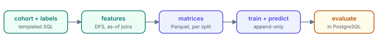
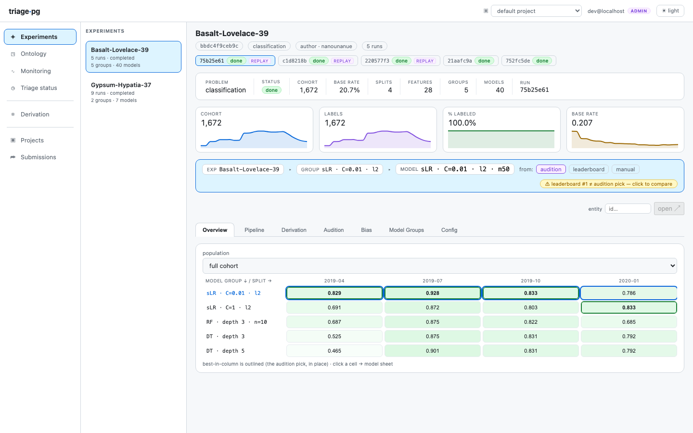

This page does one job: **prove your setup works**. Every step has a PASS
criterion; if all of them hold, your machine can run everything else on this
site. It is triage-pg's homage to DSSG triage's
[Dirty Duckling](https://dssg.github.io/triage/dirtyduck/dirty_duckling/) —
the fast way to test the waters before the full
[DirtyDuck case study](/triage-pg/tutorials/dirtyduck/).

You need: **Docker**, **[uv](https://docs.astral.sh/uv/)**, and a checkout of
[ccd-ia/triage-pg](https://github.com/ccd-ia/triage-pg). Everything runs from
the repo root. About ten minutes total; the food-inspections database and the
experiment run entirely on your machine.

## Step 1 — the CLI exists

```bash
uv sync --extra dev --extra dashboard
uv run triage --version
```

**PASS:** the version prints:

```text
triage-pg 1.1.4
```

**If it fails:** `uv: command not found` → install uv
(`curl -LsSf https://astral.sh/uv/install.sh | sh`). A Python resolution error
→ you need Python 3.12+ (`uv python install 3.12`).

## Step 2 — the tutorial database is up

```bash
just tutorial-up          # docker compose: builds + starts the food DB
pg_isready -h 127.0.0.1 -p 5440
```

**PASS:**

```text
127.0.0.1:5440 - accepting connections
```

**If it fails:** Docker isn't running (start Docker Desktop / `dockerd`), or
port 5440 is taken — set another port and re-run:
`export DIRTYDUCK_PG_PORT=5444 && just tutorial-up` (then use that port and
adjust `dirtyduck-database.yaml` accordingly). First build takes a few minutes;
`just tutorial-logs` shows progress.

Now tell the CLI how to reach it. Create the connection file (it's git-ignored —
local config holding the tutorial's throwaway credentials):

```bash
cat > dirtyduck-database.yaml <<'YAML'
host: 127.0.0.1
user: food_user
pass: some_password
port: 5440
db: food
YAML
```

## Step 3 — the results schema exists

```bash
uv run triage --dbfile dirtyduck-database.yaml db upgrade
```

**PASS:** migrations stream by and it ends with:

```text
Database upgraded.
```

The food database ships with the *source* tables (`raw`, `clean`,
`ontology.*`); this creates the `triage` schema — experiments, runs, the
artifact DAG, append-only predictions, the in-PG evaluation functions — via
alembic, idempotently (re-running is a no-op).

## Step 4 — the config validates

```bash
uv run triage --dbfile dirtyduck-database.yaml analyze-config example/dirtyduck/experiment.yaml
```

**PASS:** a panel report with **no errors** — the temporal splits, a model grid
of 8, the 32 models that grid will actually produce, and the cohort/label SQL
summaries:

```text
  Feature columns                          147
  Temporal splits                            4
  Matrices to build      8  (4 train + 4 test)
  Model grid size                            8
  Model groups                               8
  Feature-group runs                         1
  Models to be trained                      32
╭──────────── Label Configuration ────────────╮
│ Label name: failed_inspections              │
│ SQL: select entity_id, bool_or(result =     │
│ 'fail')::integer as outcome from            │
│ ontology.events where {as_of_date}…         │
╰─────────────────────────────────────────────╯
```

Read **Models to be trained** as the cost of Step 5: grid size × splits ×
feature-group runs (8 × 4 × 1 here). The 8 matrices are built once and every
model reads them; you'll see those exact 32 models on the leaderboard in Step 6.
Add `--estimate` and it also counts the cohort and label rows those 32 models
will be fitted on.

This is the same validator the write-webapp runs before accepting a
submission — errors come back path-addressed (`temporal_config.…`,
`label_config.query`) so you know exactly what to fix.

## Step 5 — the pipeline runs end to end

```bash
uv run triage --dbfile dirtyduck-database.yaml run \
  example/dirtyduck/experiment.yaml --project-path /tmp/dirtyduck-run
```

One command walks the whole pipeline — a few minutes on a laptop:



It builds the cohort and labels, generates point-in-time-correct features
(featurizer's as-of joins), assembles train/test matrices per temporal split,
trains a small grid, appends predictions, and evaluates in-database.

**PASS:** the terminal ends with exactly this shape:

```text
Experiment b9e38fd8f366… completed: 1 run(s), 32 model(s), 430176 prediction(s),
192 evaluation(s).
  run <your-run-id>… (all-features): 32 model(s), 430176 prediction(s), 192
evaluation(s).
storage: /tmp/dirtyduck-run
```

Two things to check beyond the counts:

- **Your experiment hash must be `b9e38fd8f366…` too.** The hash is computed
  from the *problem* (cohort + label + temporal config, nothing else) — if
  yours differs, you edited the config; that's a different experiment, which
  is exactly the reproducibility contract working.
- The run id after it is yours alone — every attempt gets a fresh one.

**If it fails** mid-run, the error names the failing stage (cohort, labels,
features, matrix, model). Re-running is safe: completed artifacts are
content-addressed and cache-hit, so a re-run resumes instead of redoing.

## Step 6 — the results are queryable

```bash
uv run triage --dbfile dirtyduck-database.yaml leaderboard b9e38fd8
```

**PASS:** a ranked table — 8 model groups × 4 test splits (as-of dates
2015-07 → 2017-01), `auc_roc` by default, logistic regressions and tree
ensembles trading places at the top, the baselines below them:

```text
  Group   Model   Algorithm              Metric    As-of        Value
  5       29      ScaledLogisticRegre…   auc_roc   2017-01-01   0.5751
  4       28      ScaledLogisticRegre…   auc_roc   2017-01-01   0.5748
  3       27      RandomForestClassif…   auc_roc   2017-01-01   0.5612
  7       31      BaselineRankMultiFe…   auc_roc   2017-01-01   0.5521
  …
```

**The floor is on the same board:** the `DummyClassifier` baseline sits at
`auc_roc` 0.500 while the top model reaches 0.575 (2017-01 split) — every real
model clears the floor, so the features are earning their keep. That gap is the
whole point of shipping baselines in the grid.

**Want a bigger gap?** This config features the inspection *verdict*
(`result`/`risk`) and never its *content* — what inspectors actually found.
[`experiment-violations.yaml`](https://github.com/ccd-ia/triage-pg/blob/main/example/dirtyduck/experiment-violations.yaml)
promotes the violations record into typed counts (`n_critical`, …) and keyword
flags over the inspector's comment ("did a prior inspection mention rodents"),
then uses a `feature_groups` leave-one-out fan-out to make the comparison
legible: with violation-content features the mean test AUC climbs to ≈ 0.62,
and *removing* them costs more than removing any other feature group — the
verdict features were the weak ones. Same experiment hash, new runs: the
leaderboard compares them directly.

Hash prefixes work everywhere the CLI takes a hash, git-style.

## PASS — now the five-minute tour

Your installation works. Point the dashboard at the same database and look at
what you just built:

```bash
just serve 8001    # then open http://127.0.0.1:8001
```

(The dashboard reads the same `PG*`/dbfile resolution as the CLI; the quickest
route is `cp dirtyduck-database.yaml database.yaml` before serving.)



Five things worth 60 seconds each:

1. **The experiment header** — the `classification` pill and the per-split
   cohort / %-labeled / base-rate sparklines. The hash chip is the same
   `b9e38fd8…` the CLI printed.
2. **The heatmap** (Overview tab) — model groups × splits; the outlined cell
   is the best model per split; click one to open its model card.
3. **A model card** — threshold curves (precision/recall as you sweep the
   list size k), score histogram, feature importances.
4. **The Derivation tab** — the content-addressed artifact DAG the run built;
   re-run the same command and watch everything cache-hit.
5. **The Audition tab** — DSSG's model-selection rules (distance from best,
   regret) computed in PostgreSQL.

## Where next

- The full [**DirtyDuck case study**](/triage-pg/tutorials/dirtyduck/) — same
  data, the whole discussion: early warning vs resource prioritization,
  leakage, fairness, model selection, and the **baseline floor** (a
  `DummyClassifier` in the grid) that turns "0.58 AUC" into "0.58 vs the 0.50
  floor — the ML earns its keep").
- The [**Baselines reference**](/triage-pg/reference/baselines/) — a metric
  floor for every `problem_type` (Dummy, time-series, marginal survival) and
  how to read the floor-vs-model gap.
- The [onboarding one-pager](https://ccd-ia.github.io/triage-pg/onboarding.html)
  for the system-at-a-glance view.
- `just tutorial-down` stops the database; `just tutorial-clean` removes it
  entirely (containers, images, volumes).
