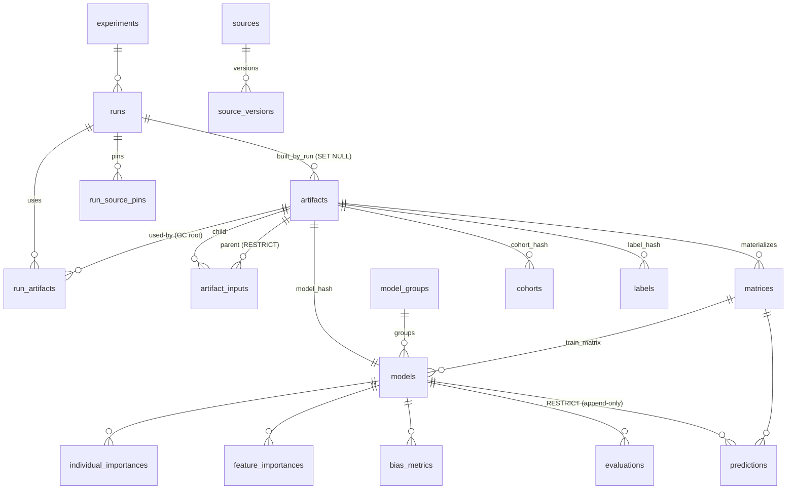

# triage-pg — Results-Schema ERD

Entity-relationship diagram of the per-project `triage` schema, as defined in the
greenfield Alembic baseline
[`src/triage/component/results_schema/alembic/versions/0001_initial_triage_schema.py`](../src/triage/component/results_schema/alembic/versions/0001_initial_triage_schema.py).
This is the single source of DDL truth (ADRs 0014–0017 were folded into the baseline; there
are no separate migrations yet). The **registry** control-plane database (ADR-0002,
`docs/schema-design.md` §3) is intentionally deferred and is *not* shown here.

## Diagram

Standalone tables (no foreign keys): `protected_groups` (keyed by `entity_id, as_of_date,
attribute_name`) and `subsets` (schema present; the subset evaluation feature is deferred).

## Table clusters

| Cluster | Tables | Purpose |
|---|---|---|
| Lineage / run metadata | `experiments`, `runs`, `model_groups` | Experiment config + soft-archive root; per-execution runs; hyperparameter-grouped models. |
| Artifact derivation DAG | `artifacts`, `artifact_inputs`, `run_artifacts` | Hash-identified artifacts; provenance edges (child→parent); usage edges (GC roots). |
| Source registry & pinning | `sources`, `source_versions`, `run_source_pins` | Declared inputs; registered versions (advisory fingerprints); pins frozen per run. |
| Cohorts & labels | `cohorts`, `labels`, `protected_groups` | Entity roster per `as_of_date`; survival-ready labels; protected attributes (long format). |
| Matrices & models | `matrices`, `models` | Parquet design matrices (by `split_kind`); trained models tied to artifact nodes. |
| Predictions | `predictions` (+ `predictions_default`) | Append-only, range-partitioned on `scored_at`. |
| Evaluation & bias | `evaluations`, `bias_metrics`, `subsets` | In-PG metrics per model × split × date; long-format bias group-bys. |
| Importances | `feature_importances`, `individual_importances` | Model-level (train time) and per-entity (predict time) importances. |

Views: `current_source_pins`, `latest_predictions`, `prediction_ranks`; materialized view
`leaderboard`.

Enums: `problem_type` (`classification`, `regression_ranking`, `regression`, `survival`),
`split_kind` (`train`, `test`, `validation`, `production`), `run_status`, `artifact_kind`
(`cohort`, `labels`, `feature_group`, `matrix`, `model`).

## Foreign-key edges (with ON DELETE behavior)

**CASCADE** — removing the parent removes dependents:
- `runs.experiment_hash` → `experiments`
- `artifact_inputs.artifact_id` → `artifacts`
- `run_artifacts.run_id` → `runs`; `run_artifacts.artifact_id` → `artifacts`
- `matrices.artifact_id` → `artifacts`
- `models.model_group_id` → `model_groups`; `models.model_hash` → `artifacts` (unique)
- `cohorts.cohort_hash` → `artifacts`; `labels.label_hash` → `artifacts`
- `evaluations.model_id`, `bias_metrics.model_id`, `feature_importances.model_id`,
  `individual_importances.model_id` → `models`
- `source_versions.source_name` → `sources`
- `run_source_pins.run_id` → `runs`  *(note: `run_source_pins.source_name` has NO FK — the
  pin is an immutable historical record that must survive registry changes)*

**RESTRICT** — child blocks parent deletion:
- `predictions.model_id` → `models` — enforces append-only history (ADR-0006)
- `artifact_inputs.parent_id` → `artifacts` — forces bottom-up purge of the DAG (ADR-0017)

**SET NULL** — parent deletion nulls the child reference:
- `artifacts.built_by_run` → `runs`
- `matrices.built_by_run` → `runs`
- `models.run_id` → `runs`

Other references: `models.train_matrix_uuid` → `matrices`; `predictions.matrix_uuid` →
`matrices`.
