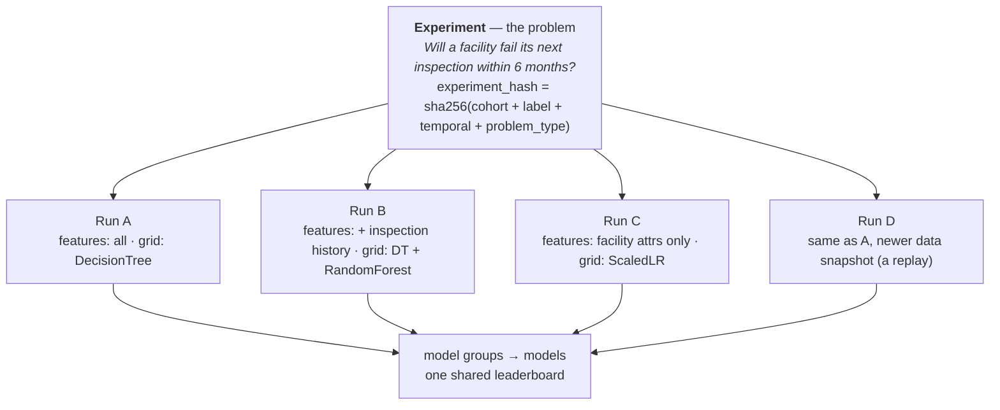
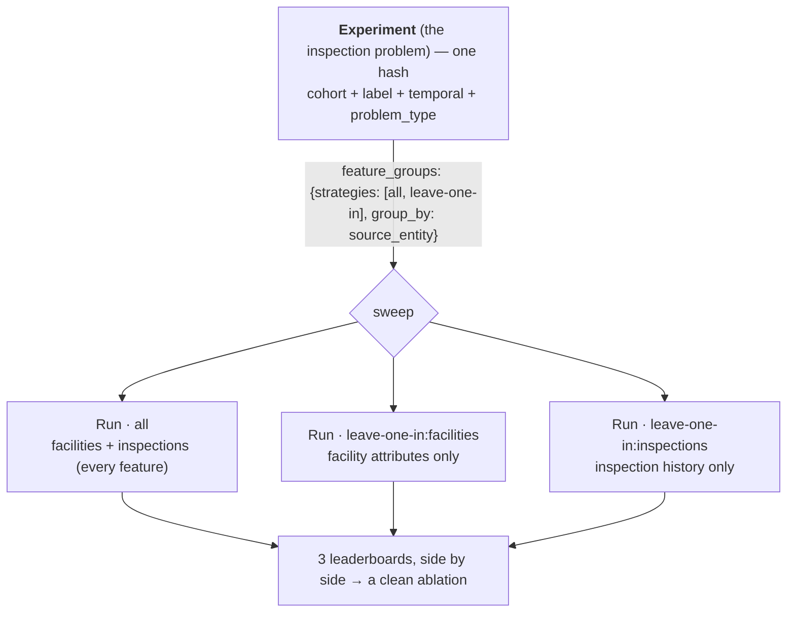
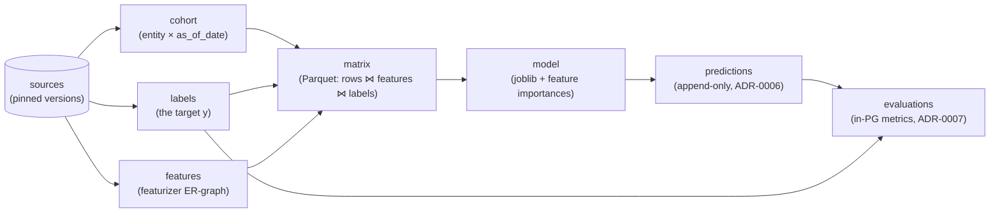

# triage-pg — Experiment & Run, explained

> The single most important mental model in the system: an **Experiment is a prediction
> problem**; a **Run is one attempt at it**. Get this right and the leaderboards, caching,
> and monitoring all fall into place.

- Source of truth: [ADR-0022](adr/0022-experiment-is-the-problem-runs-are-attempts.md) (an Experiment is the problem),
  [ADR-0023](adr/0023-feature-groups-and-strategies.md) (feature groups), [`CONTEXT.md`](../CONTEXT.md) (Experiment, Run).
- Code: [`src/triage/adapters/run.py`](../src/triage/adapters/run.py).

## 1. The idea in one breath

An **Experiment** is the problem you're trying to predict — *who* (the cohort), *what outcome*
(the label), *at which points in time* (the temporal splits), and *what kind of target* (the
`problem_type`). A **Run** is one attempt at that problem — a particular choice of **features**,
**models & hyperparameters**, and **imputation**.

One Experiment can have many Runs. They all share the same matrix rows, the same target `y`, and
the same train/test splits, so their model leaderboards are **directly comparable** — that is the
whole point of separating the two.



In code, `run_experiment(...)` returns an `ExperimentResult { experiment_hash, runs: [RunResult, …] }`.
Without feature groups there is exactly one Run; with them, one per feature subset (§5).

## 2. What identifies an Experiment

The Experiment's identity is a hash over **only the problem**. Anything that is "how you attack it"
is deliberately excluded — change it and you get a **new Run of the same Experiment**, not a new
Experiment.

```python
# adapters/run.py — the ONLY four things that define an experiment
_PROBLEM_KEYS = ("cohort_config", "label_config", "temporal_config", "problem_type")

def experiment_hash_for(config):
    return sha256(canonical_json({k: config[k] for k in _PROBLEM_KEYS}))
```

| Config key | In the experiment identity? | Why |
|---|---|---|
| `cohort_config` | ✓ **IN** | Defines the matrix rows — who is scored at each `as_of_date`. |
| `label_config` | ✓ **IN** | Defines the target `y` (and carries the `problem_type` columns). |
| `temporal_config` | ✓ **IN** | Defines the train/test splits (the `as_of_dates`) — the evaluation protocol. |
| `problem_type` | ✓ **IN** | classification / regression / regression_ranking / survival — the shape of the target. |
| `feature_config` | ✗ OUT | How you describe each entity — an attempt knob, not the problem. |
| `grid_config` | ✗ OUT | Which models / hyperparameters — an attempt knob. |
| `imputation_config` | ✗ OUT | How you fill missing values — an attempt knob. |
| `sources` / version pins | ✗ OUT | A newer data snapshot is the same problem (a new run); pins live on the run. |
| `name` / `description` | ✗ OUT | Cosmetic — stored on the experiment row but never hashed. |

**The litmus test**: would two configs produce metrics you'd want to compare on one leaderboard? If
yes (same rows, same `y`, same splits) → **same Experiment**. If comparing them would be
apples-to-oranges (different cohort, label, or splits) → **different Experiment**.

## 3. What a Run is

A **Run** is a row in `triage.runs` under an experiment. It records the *attempt* — the
feature/grid/imputation choices (and, with feature groups, which subset of features it used) — on
`runs.plan.attempt`. It also carries the **data snapshot** it ran against (the frozen
source-version pins) and live progress telemetry.

```jsonc
// what a single run records (runs.plan)
{
  "n_splits": 4, "n_models": 20, "n_feature_groups": 3,
  "attempt": {                                  // ← the run's attack on the problem
    "feature_config": { /* …featurizer ER-graph… */ },
    "grid_config": { "DecisionTree": {}, "RandomForest": {} },
    "imputation_config": { "mean": {} },
    "feature_group": "leave-one-in:inspections", // ← which subset (ADR-0023)
    "feature_group_members": ["inspections"]
  }
}
```

| Same Experiment, **new Run**, when you… | **New Experiment**, when you… |
|---|---|
| add/remove features or change the featurizer config | change *who* is in the cohort |
| change the model grid or hyperparameters | change the outcome definition (the label query) |
| change imputation | change the temporal splits (windows, frequencies, horizon) |
| re-run against a newer data snapshot (version bump) | switch `problem_type` (e.g. classification → survival) |
| re-run the identical config (a *replay* — §4) | |

## 4. Worked examples

Four scenarios. Watch the `experiment_hash`: it changes **only** when the problem changes.

**Example 1 — two feature sets → SAME experiment · 2 runs.** You try the inspection problem first
with just facility attributes, then again adding inspection-history aggregations. Cohort, label,
temporal, problem_type are untouched.

```python
cfg_a.feature_config = {...facility attrs...}
cfg_b.feature_config = {...facility attrs + inspection history...}
experiment_hash_for(cfg_a) == experiment_hash_for(cfg_b)   # True — same problem
```

→ One Experiment, two Runs. Their leaderboards sit side by side; you can read off *"inspection
history added +0.07 precision@10%"* because everything else was held fixed.

**Example 2 — change the cohort → DIFFERENT experiment.** You restrict the cohort to high-risk
facilities only. Now the matrix rows differ — a different population, a different question.

```python
cfg_b.cohort_config.query = "...WHERE risk = 'high'"
experiment_hash_for(cfg_a) != experiment_hash_for(cfg_b)   # different problem
```

→ Two Experiments. Comparing their metrics directly would be misleading (the base rates and
populations differ), so the system keeps them apart.

**Example 3 — newer data, same config → SAME experiment · new run.** A month later the source
tables have new rows. You bump the source version and re-run the identical experiment config.

```python
cfg.sources[0].version_label = "v2"   # newer snapshot — OUT of the experiment hash
# experiment_hash unchanged; a NEW run row, pinned to v2
```

→ Same Experiment, a fresh Run on newer data. This is the seed of **monitoring** (ADR-0006): the
prediction history accumulates under one problem over time.

**Example 4 — re-run the identical config → SAME experiment · replay.** You run the exact same
config twice. The experiment row is reused; a second Run is created, but every artifact (cohort,
labels, matrices, models) **cache-hits** the first run via the derivation DAG — nothing is rebuilt.

```python
first  = run_experiment(cfg).runs[0]
second = run_experiment(cfg).runs[0]
second.experiment_hash == first.experiment_hash   # reused experiment
second.run_id != first.run_id                     # new run row
# 0 new artifact / matrix / model rows — all cache hits (a "replay")
```

## 5. Feature groups: one command, many Runs (ADR-0023)

This is where the "one Experiment → many Runs" model earns its keep. **Feature groups** partition
the feature columns into named blocks; **strategies** sweep those blocks into subsets; and **each
subset becomes a Run** — automatically, from a single `triage run`.

For DirtyDuck the columns partition by their source entity into two groups: `facilities` (the
facility-type / zip one-hots) and `inspections` (the rolling-window aggregations). Sweeping
`leave-one-in` + `all` gives three Runs:



Read the three leaderboards together and you've run a clean ablation: *"how much does inspection
history add over facility attributes alone?"* — the classic triage feature-group study, now native
to triage-pg.

| strategy | produces | over N groups |
|---|---|---|
| `all` | one subset: every group together | 1 run |
| `leave-one-in` | each group in isolation | N runs |
| `leave-one-out` | everything except one group, each | N runs |
| `all-combinations` | every non-empty subset (powerset) | 2ᴺ−1 runs (capped) |

Subsets that repeat across strategies are de-duplicated; an empty subset (leave-one-out of a single
group) is skipped. `all-combinations` is guarded by `all_combinations_max_groups` so a fat entity
graph can't silently explode.

**Under the hood (efficient + correct):** featurizer runs **once per split** (the full matrix).
Each subset is a *column projection* of that one Parquet — the feature subset enters the model's
identity (its `feature_list` + model-group), so subsets mint distinct, separately-grouped models
**without re-featurizing or copying matrices**. Feature groups never touch featurizer itself
(ADR-0008): they're a triage-pg adapter concern.

## 6. The artifacts a Run builds (the derivation DAG)

Each Run drives the cohort → labels → matrices → train → predict → evaluate pipeline. Every artifact
is content-addressed over its complete input closure (Guix-style; [ADR-0013](adr/0013-artifact-identity-derivation-hash.md),
[`derivation-dag.md`](derivation-dag.md)), so artifacts shared across Runs of one Experiment are
built **once** and reused.



Cohort, labels, and matrices depend only on the **problem** (+ data snapshot), so all Runs of one
Experiment share them; models/predictions/evaluations are per-Run (they depend on the attempt).

## 7. Why it's built this way

- **Fair comparison.** Model selection only makes sense when the contestants face the same test. By
  pinning the problem (rows, `y`, splits) to the Experiment and letting only the attempt vary per
  Run, every Run under one Experiment is on the same leaderboard — apples to apples, by construction.
- **Monitoring-ready.** Because a newer data snapshot is "the same problem, a new run" (not a new
  experiment), prediction history accumulates under one problem over time — the seed of drift
  monitoring (ADR-0006, append-only predictions).
- **Caching & reproducibility.** Runs of one Experiment share cohort, labels, and matrices through
  the derivation DAG (ADR-0013): build once, reuse everywhere. A re-run is a near-free *replay*.
  Each Run also freezes its exact data snapshot (source pins), so it is reproducible.
- **Clean human story.** The dashboard groups by Experiment (the question) then Run (the attempt)
  then model. *"Why did we make 4 experiments?"* stops being a mystery: 4 attempts at one problem
  are 4 Runs of one Experiment — which is exactly what ADR-0022 fixed.

## 8. Cheat-sheet

| | |
|---|---|
| **Experiment** | The prediction *problem*: cohort + label + temporal + problem_type. Hashed → `experiment_hash`. |
| **Run** | One *attempt*: features + grid + imputation (+ which feature subset), against one data snapshot. |
| **1 → N** | One Experiment has many Runs. `run_experiment()` → `ExperimentResult.runs[]`. |
| **Same exp?** | Only cohort/label/temporal/problem_type matter. Everything else → new Run, same Experiment. |
| **Feature groups** | Partition features → strategies → one Run per subset, all sharing the Experiment (ADR-0023). |
| **Replay** | Re-running an identical config = a new Run whose artifacts all cache-hit (nothing rebuilt). |
| **Compare** | Runs of one Experiment → one leaderboard (fair). Across Experiments → don't compare directly. |
