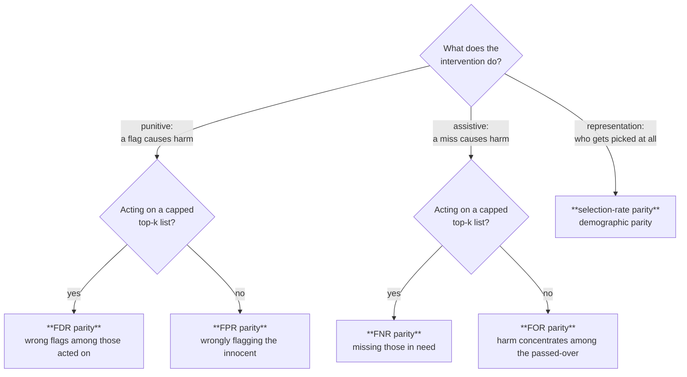

# Fairness auditing in triage-pg

Bias/fairness metrics are **SQL group-bys over `triage.protected_groups`** (ADR-0007 —
the Aequitas library is dropped; migration 0014 completes the metric set). Everything
here runs in the project database; the dashboard's Bias tab and the config blocks below
are thin surfaces over one PL/pgSQL function, `triage.compute_bias_metrics`.

Credit where it is due: the metric definitions and the decision tree below follow
[Aequitas](https://datasciencepublicpolicy.org/our-work/tools-guides/aequitas/) (DSaPP /
CMU). triage-pg reimplements them in SQL; it does not diminish the original work.

## The fairness tree — which disparity actually matters?

Showing eight disparity columns with equal weight is a way of answering nothing. The
Aequitas fairness tree asks two questions about your **intervention** and routes you to
the disparity family that carries the harm:



The dashboard's Bias tab embeds this as a two-question wizard: it **highlights** the
relevant metric family and explains why — it never hides the other metrics and never
blocks a workflow. Fairness judgment stays with the human; the tree routes attention.
Set `bias_config.intervention` to preseed it.

## The metrics (exactly as the SQL computes them)

For each protected group at the top-k cut (`selected` = `rank_abs <= k`), with
`tp/fp/fn/tn` counted inside the group and `group_pos`/`group_neg` the group's
labeled positives/negatives:

| Metric | Formula | Reads as |
|---|---|---|
| `group_size` | count | — (no disparity) |
| `num_selected` | count selected | — (no disparity) |
| `selection_rate` | `num_selected / group_size` | how much of the group gets picked |
| `precision` | `tp / num_selected` | correctness among the group's selected |
| `tpr` | `tp / group_pos` | recall: positives caught |
| `fpr` | `fp / group_neg` | innocents wrongly flagged |
| `fdr` | `fp / num_selected` | wrong flags among those acted on |
| `fnr` | `fn / group_pos` | positives missed |
| `for` | `fn / (group_size − num_selected)` | need among the passed-over |
| `npv` | `tn / (group_size − num_selected)` | correct clearances among the passed-over |

Every rate carries a **disparity** = group value ÷ reference-group value, and a
**fairness verdict**: `passes_fairness` = disparity ∈ [τ, 1/τ] (`tau`, default 0.8 —
the four-fifths rule). Both are computed and stored in SQL (`triage.bias_metrics`,
migration 0014), so `psql` and the dashboard read the same verdicts. A NULL disparity
(reference value 0, or a count metric) yields a NULL verdict — "no verdict" is
deliberately distinguishable from "fails".

**Reference group policy**: per attribute, the largest group by default; pin one
explicitly with `ref_groups` (e.g. `{race: white}`).

## Running it end-to-end: `bias_config`

```yaml
bias_config:
  query: |            # {as_of_date} required. Returns entity_id + one column per attribute.
    select entity_id, race, sex
    from ontology.demographics
    where knowledge_date < '{as_of_date}'
  parameter: 100_abs   # required — the top-k cut the audit runs at
  ref_groups: {race: white}   # optional; default = largest group
  tau: 0.8                    # optional fairness threshold
  intervention: assistive     # optional: punitive | assistive | representation
```

What happens on `triage run`:

1. after the cohort is built, the query runs per `as_of_date`; the wide result
   (entity_id + attribute columns) is melted into `triage.protected_groups`
   (idempotent upsert — re-runs refresh values; NULL attribute values are skipped);
2. every model's evaluation pass also calls `triage.compute_bias_metrics` at
   `parameter`, writing the long-format rows + disparities + verdicts;
3. the Bias tab (and plain SQL) reads them, with the wizard preseeded from
   `intervention`.

`bias_config` is **identity-neutral**: it is not part of the ADR-0022 experiment hash.
Adding an audit to an existing experiment does not change what problem it is.

Ad-hoc / headless (ADR-0012), against an already-scored model:

```sql
select triage.compute_bias_metrics(
    42, 'test', date '2019-09-01', interval '14 days',
    '100_abs', '{"race": "white"}'::jsonb, 0.8);

select attribute_value, metric, value, disparity, passes_fairness
from triage.bias_metrics
where model_id = 42 and metric in ('fnr', 'for')
order by attribute_value, metric;
```

## Worked example (Chicago 311)

The tutorial dataset has no personal demographics, so the honest protected-attribute
proxy is geographic: audit by community area. With the request's area as the attribute:

```yaml
bias_config:
  query: |
    select entity_id, community_area
    from ontology.service_requests
    where created_date < '{as_of_date}'
  parameter: 300_abs
  intervention: assistive   # a missed SLA breach = a neighborhood left waiting
```

The tree routes an assistive, capped intervention to **FNR parity**: are we missing
looming SLA breaches at a higher rate in some areas than others?


<!-- regenerate with scripts/capture_screenshots.py — the Bias tab with the
     fairness-tree wizard, focus family highlighted, pass/fail grid at τ -->

## What triage-pg deliberately does NOT reimplement from Aequitas

Group-significance testing and the automated fairness-determination report. The
disparity group-bys + τ verdicts + the tree cover the operational question ("is this
model fair enough to deploy for THIS intervention?"); statistical inference over
disparities, if ever needed, belongs in analysis notebooks, not the pipeline. Recorded
in ADR-0007 (with the Aequitas-parity validation waiver: the library is
pandas-2-incompatible, so SQL results are validated against hand-computed fixtures —
`src/tests/catwalk_tests/test_in_pg_metrics.py`).
