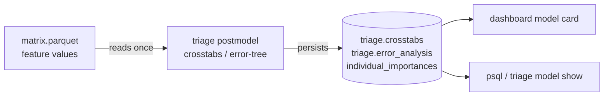
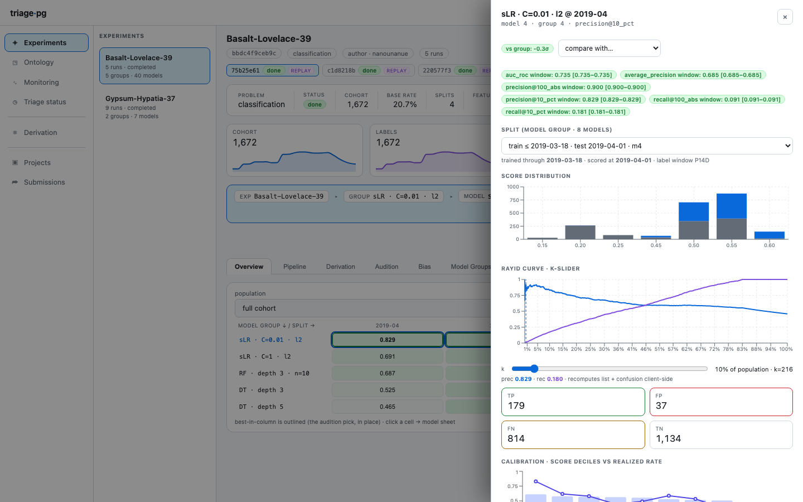

# Postmodeling diagnostics

ADR-0011 dissolved the standalone postmodeling module into three things: importances
persisted at train time, SQL views, and dashboard panels. This page is the operator's
map of what shipped where — every diagnostic is **headless-first** (ADR-0012): the CLI
and the dashboard read the same tables and functions.

## The data flow (the ADR-0011 pattern)

Matrices live in Parquet (local FS or S3), **not** in PostgreSQL — so the two
diagnostics that need feature *values* follow one pattern:



Everything else (calibration, windowed rollups, list overlap, score histograms, Rayid
curves) needs only `(entity_id, score, label)` — which is already in PostgreSQL — and is
computed by SQL functions on read.



## What each surface answers

| Question | Surface | Where |
|---|---|---|
| Which model group should I pick? | audition ranking, 8 selection rules, regret + regret-next-time | `triage audition` · Audition tab · `triage.audition`/`audition_pick()` (migrations 0005/0013) |
| How do the groups compare at a glance? | avg ± σ, max regret, avg fit time per group | `triage models <hash>` · Model Groups tab |
| Is this split's model an outlier in its group? | window mean vs group avg ± σ (z-chip); the group sheet's band | model sheet / group sheet · `evaluations_windowed` ⋈ `triage.audition` |
| Is the model calibrated? | decile mean score vs realized rate | model card calibration panel · `triage model show` · `monitoring_calibration()` (migration 0012) |
| What characterizes the selected top-k? | per-feature mean/std/nonzero-rate, selected vs rest | **`triage postmodel crosstabs`** → `triage.crosstabs` → model-card panel |
| *Where* does the model fail? | error-tree rules (fp: wrong flags; fn: missed need) with support + error rate | **`triage postmodel error-tree`** → `triage.error_analysis` → model-card panel |
| Why is THIS entity ranked high? | per-entity β·x contributions (linear models) | persisted by `error-tree` → `individual_importances` → `/models/{id}/entities/{id}/importances` |
| Do two models flag the same people? | top-k intersection, Jaccard, Spearman ρ | `triage postmodel compare` · compare modal · `list_overlap()` (migration 0016) |
| Is the model fair enough for THIS intervention? | per-group disparities + τ verdicts + the fairness tree | Bias tab wizard · [`fairness.md`](fairness.md) (migration 0014) |
| Does a slice of the cohort fare worse? | every metric on a named subset (the subset is the population) | `evaluation.subsets:` config → subset selector on the heatmap (migration 0015) |

## The error tree is a diagnostic, not a booster

"Predict on the errors" here means: fit a *shallow, readable* tree on the error
indicator so its leaves say **where** the model fails
(`inspections_1y <= 1.5 AND facility_age <= 2.5 → 80% of flags wrong`). Feed that into
feature engineering, cohort definitions, or intervention design. It is deliberately
**not** used to modify scores: a stacked error-corrector would blur model identity
(what is the hash of a model pair?) and invite test-set leakage. If an error signal is
strong enough to act on, promote it to a feature and retrain — through the normal,
governed pipeline.

## Recipes

```bash
# after a run — hash from the run output, model ids from `triage models <hash> -g <group>`
uv run triage postmodel crosstabs 42 -p 100_abs
uv run triage postmodel error-tree 42 -p 100_abs --depth 3 --min-leaf 30
uv run triage postmodel compare 42 57 -p 100_abs
uv run triage model show 42
```

Re-running any diagnostic upserts in place (idempotent). The dashboard panels show an
explicit empty-state naming the CLI command until a diagnostic has been persisted —
nothing is computed behind your back.
