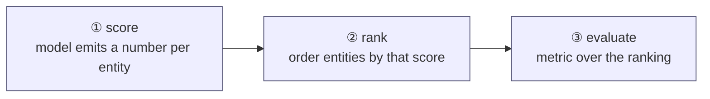
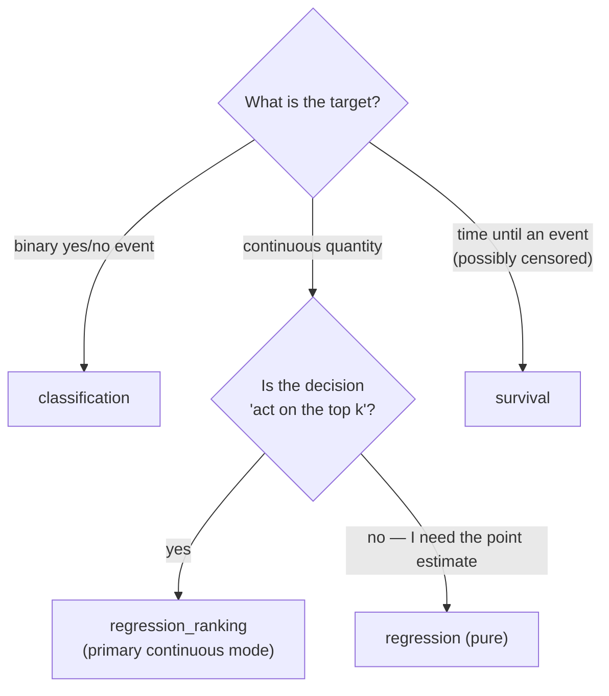

# triage-pg — `problem_type` and the ranking spine

> The narrated, exhaustive treatment of both axes — the four problem types **and** the three observation regimes (`task_framing`) — lives on the docs site: [The problem space](https://ccd-ia.github.io/triage-pg/reference/problems/). This file stays the terse in-repo reference.

> triage-pg is a **prioritization** system. Its whole architecture is one spine — **produce a score
> → rank entities → evaluate the ranking** — and the `problem_type` on an Experiment selects a few
> swaps on that spine. Pick the wrong `problem_type` and you're answering a different question.

- Source of truth: [ADR-0010](adr/0010-problem-type-ranking-spine-survival-ready-labels.md)
  (problem_type switch on a ranking spine; survival-ready labels),
  [ADR-0007](adr/0007-in-postgres-evaluation-and-sql-bias-metrics.md) (in-PG metrics, organized by problem_type).
- `problem_type` is part of the **Experiment identity** (see [experiment-and-run.md](experiment-and-run.md)):
  switching it is a *different problem*, not a new Run.

## 1. The spine

Every problem type rides the same three steps. Only the **how** of each step changes.



| `problem_type` | ① score is… | ② rank by… | ③ primary metrics | label columns |
|---|---|---|---|---|
| `classification` | `P(y=1)` | descending probability | AUC-ROC, precision@k, recall@k, AP | `outcome` (0/1) |
| `regression_ranking` | predicted value | descending predicted value | precision@k + RMSE/MAE/R² | `outcome` (continuous) |
| `regression` (pure) | predicted value | (ranking incidental) | RMSE, MAE, R² | `outcome` (continuous) |
| `survival` | predicted risk / hazard | descending risk | C-index (Brier deferred) | `duration`, `event_observed` |

**Why a ranking spine at all?** Public-policy ML is almost always *"we can act on the top *k* —
which entities?"* — slow 311 requests to escalate, facilities to inspect, students to support. The
deliverable is an **ordering**, so the spine optimizes and measures the ordering directly.
precision@k / recall@k are first-class, not afterthoughts.

## 2. The three live modes

### classification
The default. The label query emits an integer `outcome` (0/1); the model emits `P(y=1)`; entities
are ranked by that probability and scored with AUC / precision@k / recall@k / average-precision.
All three tutorial datasets (DirtyDuck inspections, DonorsChoose funding, Chicago 311 resolution)
are classification.

```yaml
problem_type: classification
label_config:
  query: |
    select entity_id, (… )::int as outcome   # 0/1
    from … where {as_of_date} <= date and date < {as_of_date}::date + {label_timespan}
```

### regression_ranking — the primary mode for continuous targets
When the target is a continuous quantity (dollars at risk, days-to-resolution, demand units) but the
**decision is still "act on the top *k*"**, rank by the predicted value. You get precision@k *on the
continuous target* **plus** the regression error metrics — the best of both: a usable priority list
and a calibrated sense of magnitude. Prefer this over pure regression whenever the output drives a
prioritized action.

```yaml
problem_type: regression_ranking
label_config:
  query: |
    select entity_id, (…)::numeric as outcome   # continuous
    from … where {as_of_date} <= date and date < {as_of_date}::date + {label_timespan}
```

### regression (pure)
When you genuinely care about the **point estimate** and not an ordering (forecasting a total, an
expected cost), use pure regression: RMSE / MAE / R² only, ranking incidental.

> **Example configs on the food DB:** `example/dirtyduck/experiment-regression.yaml`
> (`regression_ranking`, annotated) and `example/dirtyduck/experiment-pure-regression.yaml`
> (`regression`) — the two differ only by `problem_type` and the metric block.

## 3. Survival — runnable (ADR-0026)

The greenfield label schema carries, alongside `outcome`, the optional nullable
`(duration, event_observed)` columns, so `survival` needed **no schema migration** — and it is now
**fully implemented**: scikit-survival estimators (e.g. `ScaledCoxPHSurvivalAnalysis`) fit on the
censoring-aware labels, `.predict()` emits a **risk score** that rides the same score→rank→evaluate
spine, and the **C-index** is a PL/pgSQL function (`triage.c_index`, migration 0011) that matches
`sksurv.metrics.concordance_index_censored` to 1e-9. Brier score remains deferred.

```sql
-- triage.labels carries all three; classification/regression leave the survival pair NULL
label_hash, entity_id, as_of_date, label_timespan,
  outcome,                 -- classification / regression
  duration, event_observed -- survival (nullable elsewhere)
```

Survival-as-ranking (time-to-recidivism, time-to-eviction, …) is squarely in the target domain, and
binary triage would have *discarded* the censoring information ("no event in the window" = 0) that
survival needs. Requires the `survival` extra (scikit-survival): `uv sync --extra survival`.

```yaml
problem_type: survival
label_config:
  query: |
    select entity_id, duration, event_observed   # censoring-aware label
    from … where …
```

> **Example configs:** `example/dirtyduck/experiment-survival.yaml` and
> `example/chicago311/experiment-survival.yaml`.

## 4. Choosing — a 10-second guide



| If you… | use |
|---|---|
| predict a yes/no outcome and rank by probability | `classification` |
| predict a continuous value but still act on a top-*k* list | `regression_ranking` |
| only need an accurate point estimate, no prioritization | `regression` |
| predict time-to-event with censoring | `survival` |
